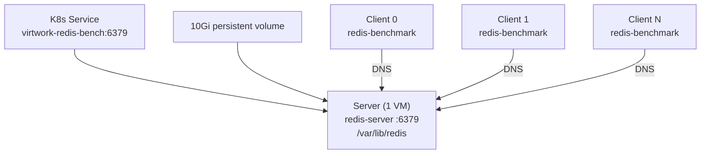

# redis-bench — Redis Server/Client Benchmark Workload

Multi-VM database benchmarking workload with a persistent Redis server and
`redis-benchmark` client(s). The server stores data on a 10Gi persistent volume
with AOF durability; clients generate configurable load and report throughput and
latency percentiles.

## Architecture



Scale clients with `--params workload.vm-count=N`

## Parameters

| Parameter | Type | Default | Description |
|-----------|------|---------|-------------|
| `num-clients` | int | `10` | Concurrent clients per benchmark run (`-c`) |
| `num-requests` | int | `100000` | Total requests per iteration (`-n`) |
| `pipeline-size` | int | `1` | Pipelining factor (`-P`); `1` = no pipelining |
| `test-mode` | string | `set,get` | Redis operations to benchmark (`-t`) |
| `data-size` | int | `256` | Value size in bytes (`-d`) |
| `loop-delay` | int | `30` | Seconds between benchmark iterations |
| `maxmemory` | string | `256mb` | Redis server memory limit (`--maxmemory`) |

### Parameter details

**num-clients** — Number of parallel connections per `redis-benchmark` invocation.
Higher values increase throughput but also increase latency. Typical range: 1–100.

**num-requests** — Total operations per iteration. More requests produce more stable
latency percentiles. Use 100000+ for reliable p99 numbers.

**pipeline-size** — Batches multiple requests per round-trip. Setting this to 16+
dramatically increases throughput by reducing network overhead. Start at 1 for
latency-focused testing.

**test-mode** — Comma-separated list of Redis commands to benchmark. Options include
`set`, `get`, `incr`, `lpush`, `lpop`, `sadd`, `spop`, `hset`, `hget`, `zadd`,
`zrange`. Common combinations:

- `set,get` — key-value read/write (default, most representative)
- `get` — read-only (cache simulation)
- `set` — write-only (ingest simulation)
- `lpush,lpop` — list operations (queue simulation)

**data-size** — Value payload in bytes for SET/GET. Larger values stress network I/O
and memory. Typical range: 64–4096.

**loop-delay** — Pause between benchmark runs. Allows distinct measurement windows for
metrics scrapers.

**maxmemory** — Server-side memory cap. When reached, Redis evicts keys using the
`allkeys-lru` policy. Set relative to VM memory allocation.

## Storage

| Field | Value |
|-------|-------|
| Volume name | `redis-data` |
| Size | `10Gi` |
| Serial | `vw-redis` |
| Device path | `/dev/disk/by-id/virtio-vw-redis` |
| Mount point | `/var/lib/redis` |
| Filesystem | XFS (auto-formatted) |

The disk setup script (injected automatically by the catalog system) waits for the
device, formats it with XFS if needed, mounts it, and adds an fstab entry. Redis
AOF files are written to this volume for durability.

## Usage

```bash
# Default: 10 clients, SET+GET, 100K requests per iteration
virtwork run --from-catalog redis-bench --catalog-dir ./catalog --dry-run

# High-throughput: 32 clients, pipelining, 1M requests
virtwork run --from-catalog redis-bench --catalog-dir ./catalog \
  --params redis-bench.num-clients=32,redis-bench.pipeline-size=16,redis-bench.num-requests=1000000

# Read-heavy: GET-only, 64 clients, large values
virtwork run --from-catalog redis-bench --catalog-dir ./catalog \
  --params redis-bench.test-mode=get,redis-bench.num-clients=64,redis-bench.data-size=4096

# Write-heavy: SET-only, small values
virtwork run --from-catalog redis-bench --catalog-dir ./catalog \
  --params redis-bench.test-mode=set,redis-bench.num-clients=50,redis-bench.data-size=64

# Queue workload: list operations
virtwork run --from-catalog redis-bench --catalog-dir ./catalog \
  --params redis-bench.test-mode=lpush,redis-bench.num-clients=20

# Scale to 3 client VMs
virtwork run --from-catalog redis-bench --catalog-dir ./catalog \
  --vm-count 3 --params redis-bench.num-clients=16,redis-bench.pipeline-size=8
```

## Monitoring

### Server VM

```bash
# Check Redis is running
systemctl status server.service
journalctl -u server.service -f

# Verify storage mount
df -h /var/lib/redis
ls -la /dev/disk/by-id/ | grep vw-redis

# Redis stats
redis-cli info server
redis-cli info memory
redis-cli info stats
```

### Client VM

```bash
# Check benchmark is running
systemctl status client.service
journalctl -u client.service -f
```

### Key metrics

- **Throughput** (requests/sec) — typical range: 10K–100K ops/sec
- **Latency** (avg/p50/p95/p99 in ms) — sub-millisecond for in-cluster traffic
- **Memory usage** — server memory grows with data-size and working set
- **Disk I/O** — AOF writes visible in storage metrics

## Troubleshooting

**Server fails to start** — Check that the storage volume mounted correctly.
Inspect `/var/log/cloud-init-output.log` for disk setup errors. Verify the device
exists: `ls /dev/disk/by-id/virtio-vw-redis`.

**Client can't connect** — Verify the K8s Service exists (`oc get svc | grep redis`)
and DNS resolves (`nslookup virtwork-redis-bench` from the client VM). Check that
Redis is listening: `redis-cli -h <server-pod-ip> ping`.

**Low throughput** — Increase `pipeline-size` to reduce round-trip overhead. Check
for network contention with `oc top`. Ensure the server VM has enough CPU cores.

**Redis OOM / evictions** — Increase `maxmemory` or reduce `data-size`. Monitor with
`redis-cli info memory`. The `allkeys-lru` eviction policy is configured by default.
