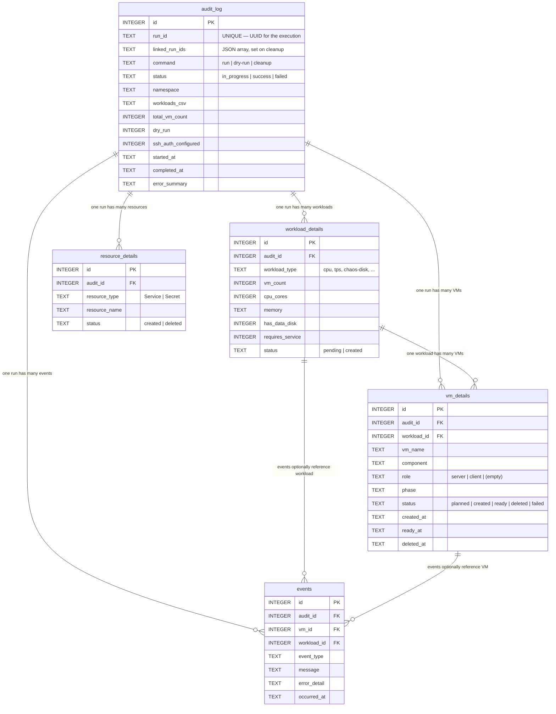
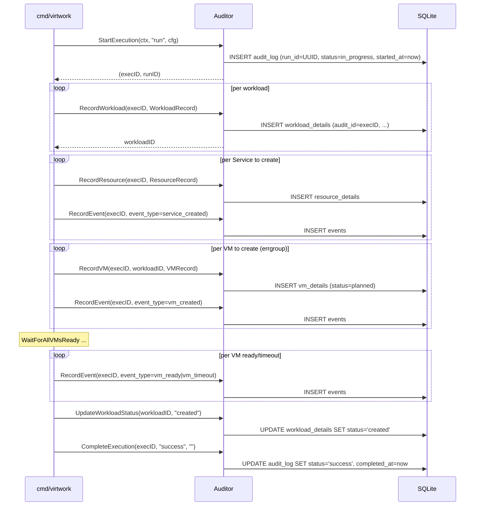

# Audit Database Schema

Every `virtwork run` and `virtwork cleanup` execution is recorded in a local SQLite database (`virtwork.db` by default) so that what happened, when, with what configuration, and with what outcome is always recoverable — even when the cluster itself is gone.

This document is the reference for the schema: tables, columns, indexes, relationships, and how rows are produced over an execution's lifetime.

## Storage and Implementation

- **Backing store:** SQLite, opened in WAL mode for concurrent-read safety. The file path is `virtwork.db` by default, overridden via `--audit-db` / `VIRTWORK_AUDIT_DB` / `audit_db` YAML key. When deployed in-cluster the path is `/data/virtwork.db` on the audit PVC.
- **Interface:** `internal/audit.Auditor` with two implementations: `SQLiteAuditor` (the real one) and `NoOpAuditor` (returned when `--no-audit` or `VIRTWORK_AUDIT=false` is set).
- **PostgreSQL compatibility:** all `TEXT` timestamps use ISO 8601 strings; `linked_run_ids` is a JSON array stored as `TEXT` so the same shape migrates cleanly to PostgreSQL JSONB if needed later.
- **DDL location:** `internal/audit/schema.go`. Record structs that map to inserts live in `internal/audit/records.go`.

## Entity-Relationship Diagram



## Tables

### `audit_log` — one row per execution

| Column | Type | Notes |
|---|---|---|
| `id` | INTEGER PK | Autoincrement |
| `run_id` | TEXT UNIQUE NOT NULL | UUID applied to all K8s resources via the `virtwork/run-id` label |
| `linked_run_ids` | TEXT | JSON array of run-IDs discovered during cleanup (NULL outside of cleanup) |
| `command` | TEXT NOT NULL | `run`, `dry-run`, `cleanup`, or `cleanup --dry-run` |
| `status` | TEXT NOT NULL | `in_progress` initially, `success` or `failed` on completion |
| `kubeconfig_path` | TEXT | Path used to connect (NULL when in-cluster) |
| `cluster_context` | TEXT | Current kubeconfig context name; `in-cluster` when using service account; NULL for dry-run |
| `namespace` | TEXT NOT NULL | Target namespace |
| `container_disk_image` | TEXT | Configured boot image |
| `default_cpu_cores` | INTEGER | Global `--cpu-cores` default |
| `default_memory` | TEXT | Global `--memory` default |
| `data_disk_size` | TEXT | Global `--disk-size` default |
| `workloads_csv` | TEXT | Comma-separated list of workload names requested |
| `total_vm_count` | INTEGER | Total VMs planned across all workloads |
| `total_workload_count` | INTEGER | Number of workload types deployed |
| `dry_run` | INTEGER NOT NULL | 0 or 1 |
| `ssh_auth_configured` | INTEGER NOT NULL | 1 if any SSH credential was provided. **Credentials are never stored.** |
| `cleanup_mode` | TEXT | Cleanup command only: `all` (no filter), `run-id` (specific run), `dry-run` (no deletion); NULL for run commands |
| `wait_for_ready` | INTEGER NOT NULL | 0 or 1; reflects `--no-wait` inverted |
| `ready_timeout_seconds` | INTEGER | Effective readiness timeout |
| `vms_deleted` | INTEGER | Cleanup only: count from `CleanupResult` |
| `services_deleted` | INTEGER | Cleanup only |
| `secrets_deleted` | INTEGER | Cleanup only |
| `namespace_deleted` | INTEGER | Cleanup only: 0 or 1 |
| `started_at` | TEXT NOT NULL | ISO 8601 timestamp |
| `completed_at` | TEXT | NULL while in flight |
| `error_summary` | TEXT | Populated when `status = 'failed'` |

Indexes: `started_at`, `namespace`, `status`, `run_id`.

### `workload_details` — one row per workload-type per execution

| Column | Type | Notes |
|---|---|---|
| `id` | INTEGER PK | |
| `audit_id` | INTEGER NOT NULL | FK → `audit_log.id` |
| `workload_type` | TEXT NOT NULL | `cpu`, `memory`, `disk`, `database`, `network`, `tps`, `chaos-disk`, `chaos-network`, `chaos-process` |
| `enabled` | INTEGER NOT NULL | 0 or 1 (always 1 in current orchestration) |
| `vm_count` | INTEGER NOT NULL | Reported by `Workload.VMCount()` — `N` for single-VM, `N × len(Roles())` for multi-VM |
| `cpu_cores` | INTEGER NOT NULL | Effective per-VM CPU cores |
| `memory` | TEXT NOT NULL | Effective per-VM memory (e.g., `2Gi`) |
| `has_data_disk` | INTEGER NOT NULL | 1 when `DataVolumeTemplates()` is non-empty |
| `data_disk_size` | TEXT | NULL when `has_data_disk = 0` |
| `requires_service` | INTEGER NOT NULL | 1 for multi-VM workloads (network, tps) |
| `status` | TEXT NOT NULL | `pending` → `created` (after all VMs succeed) or `failed` (on VM creation or readiness error) |

Indexes: `audit_id`, `workload_type`.

### `vm_details` — one row per VM

| Column | Type | Notes |
|---|---|---|
| `id` | INTEGER PK | |
| `audit_id` | INTEGER NOT NULL | FK → `audit_log.id` |
| `workload_id` | INTEGER | FK → `workload_details.id` |
| `vm_name` | TEXT NOT NULL | e.g., `virtwork-cpu-0`, `virtwork-network-server-0` |
| `namespace` | TEXT NOT NULL | |
| `component` | TEXT NOT NULL | Workload name (matches `workload_details.workload_type`) |
| `role` | TEXT | `server` / `client` for multi-VM workloads; empty for single-VM |
| `cpu_cores` | INTEGER NOT NULL | |
| `memory` | TEXT NOT NULL | |
| `container_disk_image` | TEXT NOT NULL | |
| `has_data_disk` | INTEGER NOT NULL | |
| `data_disk_size` | TEXT | |
| `phase` | TEXT | Latest known VMI phase (`Pending`, `Scheduled`, `Running`, …) |
| `status` | TEXT NOT NULL | `planned` → `created` → `ready` / `failed` / `deleted` |
| `created_at` | TEXT | Set when `CreateVM` succeeds |
| `ready_at` | TEXT | Set when readiness polling succeeds |
| `deleted_at` | TEXT | Set during cleanup |

Indexes: `audit_id`, `workload_id`, `vm_name`.

### `resource_details` — one row per non-VM K8s resource

Tracks Services and Secrets created by orchestration. (VMs go in `vm_details`.)

| Column | Type | Notes |
|---|---|---|
| `id` | INTEGER PK | |
| `audit_id` | INTEGER NOT NULL | FK → `audit_log.id` |
| `resource_type` | TEXT NOT NULL | `Service` or `Secret` |
| `resource_name` | TEXT NOT NULL | e.g., `virtwork-iperf3-server`, `virtwork-cpu-0-cloudinit` |
| `namespace` | TEXT NOT NULL | |
| `status` | TEXT NOT NULL | `created` or `deleted` |
| `created_at` | TEXT | |
| `deleted_at` | TEXT | Set during cleanup |

Indexes: `audit_id`, `resource_type`.

### `events` — append-only event log

| Column | Type | Notes |
|---|---|---|
| `id` | INTEGER PK | |
| `audit_id` | INTEGER NOT NULL | FK → `audit_log.id` |
| `vm_id` | INTEGER | FK → `vm_details.id` (optional) |
| `workload_id` | INTEGER | FK → `workload_details.id` (optional) |
| `event_type` | TEXT NOT NULL | See enumeration below |
| `message` | TEXT | Free-form |
| `error_detail` | TEXT | Set when the event represents a failure |
| `occurred_at` | TEXT NOT NULL | |

Indexes: `audit_id`, `event_type`, `occurred_at`.

**Common `event_type` values emitted by the orchestrator today:**

| `event_type` | When emitted |
|---|---|
| `execution_started` | Two per run — once for "Starting" and once for "Planned N VMs across M workloads" |
| `service_created` | After each Service is created |
| `vm_created` | After each VM is successfully created on the cluster |
| `vm_failed` | When `CreateVM` returns an error |
| `vm_ready` | After readiness polling confirms `Running` |
| `vm_timeout` | When a VM fails readiness check |
| `cleanup_started` | Beginning of `cleanup` execution |
| `cleanup_completed` | End of `cleanup` execution, with the deletion counts |

---

## Lifecycle: How Rows Appear



Cleanup is similar: a new `audit_log` row is created with `command='cleanup'`, resources are discovered by label, deleted, counted, and the `linked_run_ids` column is filled with the unique `virtwork/run-id` values that were present on the deleted resources.

---

## Common Queries

### Recent executions

```sql
SELECT id, run_id, command, status, namespace, total_vm_count, started_at
FROM audit_log
ORDER BY id DESC
LIMIT 10;
```

### VMs from a specific run

```sql
SELECT vm_name, component, role, cpu_cores, memory, status, ready_at
FROM vm_details
WHERE audit_id = (SELECT id FROM audit_log WHERE run_id = '<uuid>');
```

### Events timeline for a run

```sql
SELECT occurred_at, event_type, message
FROM events
WHERE audit_id = (SELECT id FROM audit_log WHERE run_id = '<uuid>')
ORDER BY occurred_at;
```

### Failed runs in the last day

```sql
SELECT id, run_id, command, error_summary, started_at, completed_at
FROM audit_log
WHERE status = 'failed' AND started_at >= datetime('now', '-1 day')
ORDER BY started_at DESC;
```

### Which cleanups touched a given run-id?

```sql
SELECT id, run_id, started_at, vms_deleted, services_deleted, secrets_deleted, linked_run_ids
FROM audit_log
WHERE command LIKE 'cleanup%' AND linked_run_ids LIKE '%<uuid>%';
```

### How many VMs per workload across all runs?

```sql
SELECT workload_type, SUM(vm_count) AS total_vms, COUNT(*) AS runs
FROM workload_details
GROUP BY workload_type
ORDER BY total_vms DESC;
```

### Average VM-ready latency per workload type

```sql
SELECT
  component,
  AVG((julianday(ready_at) - julianday(created_at)) * 86400) AS avg_ready_seconds
FROM vm_details
WHERE ready_at IS NOT NULL AND created_at IS NOT NULL
GROUP BY component
ORDER BY avg_ready_seconds DESC;
```

---

## For Contributors

- DDL: `internal/audit/schema.go` (`schemaSQL` constant, executed once on `NewSQLiteAuditor`).
- Insert/update methods: `internal/audit/audit.go` (`SQLiteAuditor` methods).
- Record structs that map to inserts: `internal/audit/records.go` (`WorkloadRecord`, `VMRecord`, `ResourceRecord`, `EventRecord`).
- `NoOpAuditor`: returned when audit is disabled. Implements the same interface with empty methods so call sites never need to nil-check.

### Adding a new column

1. Add the column to `schemaSQL` in `schema.go`. SQLite's `CREATE TABLE IF NOT EXISTS` will not alter an existing table — for production-like upgrades, add an explicit `ALTER TABLE` migration.
2. Add the field to the relevant `Record` struct in `records.go`.
3. Update the insert/update method in `audit.go` to include the new column.
4. Update the relevant table section in this document.
5. PostgreSQL compatibility: keep timestamps as ISO 8601 `TEXT`; use `TEXT` for JSON-shaped data (it maps cleanly to JSONB).

### Adding a new event type

Just call `RecordEvent(ctx, execID, EventRecord{EventType: "your_new_type", Message: "..."})` from the orchestrator. Add a row to the "Common `event_type` values" table above so the catalog stays current.

## Related Docs

- [configuration.md](configuration.md) — audit-related flags, env vars, YAML keys
- [deployment.md](deployment.md) — audit-DB PVC mount at `/data` for in-cluster deployments
- [development.md](development.md) — audit configuration section in the developer guide
