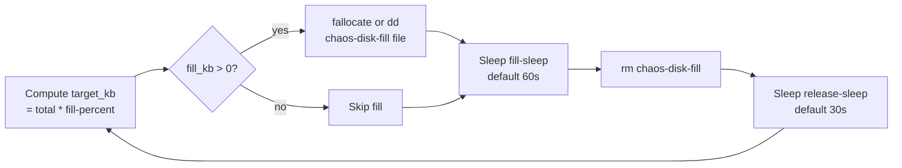

# Chaos Workloads

Virtwork ships three chaos engineering workloads that inject failures inside a VM so that monitoring stacks, alerting rules, application resilience patterns, and recovery procedures can be exercised against realistic — not synthetic — disturbances.

| Workload | What it does | Tool(s) | Storage |
|---|---|---|---|
| **chaos-disk** | Fills the data disk to a target percentage, sleeps, releases, repeats | `fallocate`, `dd` | DataVolume mounted at `/mnt/data` |
| **chaos-network** | Adds latency and packet loss on the VM's egress interface | `tc` + `netem` | None |
| **chaos-process** | Randomly signals non-essential processes inside the VM | shell + `ps`/`kill` | None |

All three run as systemd services (`virtwork-chaos-disk.service`, `virtwork-chaos-network.service`, `virtwork-chaos-process.service`) and restart automatically on failure or VM reboot.

---

## ⚠️ Destructive-Behavior Warning

Chaos workloads are **deliberately destructive within their VM**:

- **chaos-disk** consumes nearly all of the data PVC and releases it on a loop. While it's in the "fill" phase, any other process on the VM that writes to `/mnt/data` will see `ENOSPC`.
- **chaos-network** rewrites the egress qdisc on the default-route interface. All outbound traffic from that VM — including health checks, metric scrapes, and SSH responses — incurs the configured latency and drop rate.
- **chaos-process** sends signals (default `SIGTERM`) to randomly selected processes every 30 seconds. Long-running tools that are not in the exclusion list can be killed at any time.

The destructive effects are **confined to the VM** the workload runs in. Virtwork does not have a platform-level kill switch. Use namespace isolation as your safety boundary: deploy chaos workloads in their own namespace, or at least never alongside workloads you care about.

```bash
# RECOMMENDED: dedicated chaos namespace
virtwork run --namespace virtwork-chaos --workloads chaos-disk,chaos-network,chaos-process

# DO NOT: mix with workloads you intend to observe
virtwork run --workloads cpu,database,chaos-disk    # database and chaos-disk share the namespace
```

Cleanup is unchanged from any other workload — `virtwork cleanup` deletes the VMs and the chaos behavior stops with them.

---

## chaos-disk

### What it does

Continuously fills the mounted data disk to a configurable percentage, holds the fill for a configurable duration, then releases it. This produces sustained disk-pressure events that exercise:

- Filesystem-fill alerts in your monitoring stack
- Eviction or pause behavior in components that watch disk usage
- Recovery paths that depend on freeing disk space

### Flow



### Configuration

| YAML key (`workloads.chaos-disk.params.*`) | Default | Effect |
|---|---|---|
| `mount` | `/mnt/data` | Mountpoint of the data disk to fill |
| `fill-percent` | `90` | Target fill percentage of the mountpoint |
| `fill-sleep` | `60` | Seconds to hold the fill before releasing |
| `release-sleep` | `30` | Seconds to wait empty before refilling |

Example:

```yaml
workloads:
  chaos-disk:
    enabled: true
    vm_count: 1
    cpu_cores: 1
    memory: 1Gi
    params:
      fill-percent: "80"
      fill-sleep: "120"
      release-sleep: "60"
```

The data disk size comes from `--disk-size` / `VIRTWORK_DATA_DISK_SIZE` / `data_disk_size` (default `10Gi`). The disk is provisioned as a CDI `DataVolume`, mounted in-VM via the virtio Serial pattern (`/dev/disk/by-id/virtio-virtwork-chdisk`), formatted XFS, and persisted in `/etc/fstab` by the shared `diskSetupScript` helper.

### Example

```bash
virtwork run --workloads chaos-disk --disk-size 5Gi --ssh-user virtwork --ssh-key-file ~/.ssh/id_ed25519.pub

# Watch the fill/release cycle from inside the VM:
virtctl ssh --ssh-key ~/.ssh/id_ed25519 virtwork@virtwork-chaos-disk-0 -n virtwork
watch -n 5 'df -h /mnt/data'
```

You should see `/mnt/data` use rise to ~90%, hold for ~60s, drop back near baseline, hold for ~30s, and repeat.

### What to observe

- `kubelet_volume_stats_used_bytes{persistentvolumeclaim=~"virtwork-chaos-disk.*"}` from kube-state-metrics
- Pod or VMI events around disk pressure
- Any application metrics tied to free-space thresholds you have configured

---

## chaos-network

### What it does

Applies a `tc` qdisc with `netem` to the VM's default-route interface, adding latency and packet loss to every egress packet. The qdisc is installed once on service start and removed cleanly on service stop, so a `systemctl restart virtwork-chaos-network` from inside the VM disables and re-enables the impairment.

### Configuration

| YAML key (`workloads.chaos-network.params.*`) | Default | Effect |
|---|---|---|
| `latency-ms` | `100` | One-way latency to inject (`netem delay <ms>ms`) |
| `packet-loss-percent` | `5.0` | Packet drop rate (`netem loss <pct>%`) |

Example:

```yaml
workloads:
  chaos-network:
    enabled: true
    vm_count: 1
    cpu_cores: 1
    memory: 1Gi
    params:
      latency-ms: "250"
      packet-loss-percent: "10"
```

### Dependencies

The workload installs `iproute-tc` and loads the `sch_netem` kernel module on start. The base Fedora container disk has both available; the golden image (`build/golden-image/`) pre-installs `iproute-tc` to avoid the first-boot package install. `sch_netem` is loaded from the `kernel-modules-extra` package, which the cloud-init runs `dnf install` for on first boot.

### Example

```bash
virtwork run --workloads chaos-network --ssh-user virtwork --ssh-key-file ~/.ssh/id_ed25519.pub

# Inside the VM, confirm the qdisc is active:
virtctl ssh --ssh-key ~/.ssh/id_ed25519 virtwork@virtwork-chaos-network-0 -n virtwork
tc qdisc show dev eth0
# qdisc netem 8001: root refcnt 2 limit 1000 delay 100ms loss 5%

ping -c 10 1.1.1.1
# Expect ~100ms RTT and occasional packet loss
```

### What to observe

- Increased latency in your service-to-service traces (when chaos-network sits on the client side)
- Retry / circuit-breaker behavior in HTTP clients
- TCP retransmit counters (`netstat -s` inside the VM, or node-level metrics if you scrape them)

---

## chaos-process

### What it does

Every 30 seconds (configurable), randomly selects one process from the VM that is **not** in the exclusion list and sends it `SIGTERM` (configurable). Processes are eligible when their PID is at or above the configured minimum (default 1000) — this is a coarse filter to leave kernel threads and core systemd-managed processes alone.

### Exclusion list

The following process-name patterns are never targeted (built into the script):

- `systemd`
- `sshd`
- `dbus`
- `agetty`
- `auditd`
- `rsyslogd`
- `chronyd`
- `NetworkManager`
- `bash`, `sh`
- `cloud-init`
- `virtwork-*` (the chaos workload's own service)

### Configuration

| YAML key (`workloads.chaos-process.params.*`) | Default | Effect |
|---|---|---|
| `signal` | `SIGTERM` | Signal sent to the selected process (`SIGTERM`, `SIGKILL`, `SIGINT`, …) |
| `interval` | `30` | Seconds between kill attempts |
| `min-pid` | `1000` | Minimum PID considered eligible |

Example:

```yaml
workloads:
  chaos-process:
    enabled: true
    vm_count: 1
    cpu_cores: 1
    memory: 512Mi
    params:
      signal: "SIGKILL"
      interval: "15"
      min-pid: "500"
```

### Example

```bash
virtwork run --workloads chaos-process --ssh-user virtwork --ssh-key-file ~/.ssh/id_ed25519.pub

# Watch the chaos log from inside the VM:
virtctl ssh --ssh-key ~/.ssh/id_ed25519 virtwork@virtwork-chaos-process-0 -n virtwork
journalctl -u virtwork-chaos-process.service -f
```

Sample output:

```
[2026-05-22 14:00:00] Starting chaos-process workload
[2026-05-22 14:00:00] Configuration: SIGNAL=SIGTERM INTERVAL=30s MIN_PID=1000
[2026-05-22 14:00:00] Sending SIGTERM to PID 1437: 1437 cron /usr/sbin/cron -n
[2026-05-22 14:00:00] Successfully sent SIGTERM to PID 1437
[2026-05-22 14:00:30] Sending SIGTERM to PID 1502: 1502 anacron /usr/sbin/anacron -d -q -s
```

### What to observe

- Process restarts driven by systemd `Restart=` directives in any services you install alongside
- Alerts that fire when key processes disappear
- Recovery time from kill to restart

---

## Operational Guidance

### Running chaos alongside non-chaos workloads

If you must run chaos workloads in the same namespace as non-chaos workloads (for example, to apply chaos to a test database), be aware that:

- **chaos-disk** affects its own VM's data disk only — it cannot impact another VM's disk because each VM gets its own DataVolume.
- **chaos-network** affects egress from its own VM only — it does not affect traffic to or from sibling VMs.
- **chaos-process** affects processes inside its own VM only.

Cross-VM impact happens only when the *application* under test reaches across VMs and is itself affected by the chaos (e.g., a client VM with chaos-network installed will see degraded performance talking to any server VM).

### Cleanup

```bash
# Drop everything chaos-related
virtwork cleanup --namespace virtwork-chaos --delete-namespace

# Or by run ID
virtwork cleanup --run-id <uuid>
```

Cleanup is the same as any other virtwork resource — label selectors find chaos VMs and their data volumes are reclaimed automatically when the VMs are deleted (subject to the StorageClass reclaim policy).

### Audit visibility

Chaos workloads are recorded in the audit database exactly like any other workload. The `workload_details` row will have `workload_type` set to `chaos-disk` / `chaos-network` / `chaos-process`, and `events` will show `vm_created`, `vm_ready`, and on cleanup `vm_deleted` rows. See [audit-schema.md](audit-schema.md).

---

## For Contributors

Source files:

- `internal/workloads/chaos_disk.go` — `ChaosDiskWorkload` struct, `chaosDiskScript`, `chaosDiskSystemdUnit`
- `internal/workloads/chaos_network.go` — `ChaosNetworkWorkload` struct, `chaosNetworkStartScript`, `chaosNetworkStopScript`, `chaosNetworkSystemdUnit`
- `internal/workloads/chaos_process.go` — `ChaosProcessWorkload` struct, `chaosProcessScript`, `chaosProcessSystemdUnit`
- `internal/workloads/registry.go` — `DefaultRegistry()` registers all three under the names `chaos-disk`, `chaos-network`, `chaos-process`

All three embed `BaseWorkload` and use the standard `BuildCloudConfig(opts)` helper for SSH credential injection. chaos-disk additionally uses the shared `diskSetupScript(serial, mountPoint)` helper from `internal/workloads/workload.go` for the standard wait/format/mount/fstab pattern.

The configuration knobs listed above are sourced from `WorkloadConfig.Params` — the same plumbing the tps workload uses for `file-size`, `iterations`, `duration`. See [development.md](development.md) for the multi-VM / storage-backed / configurable-params patterns.

## Related Docs

- [configuration.md](configuration.md) — full reference for every configuration knob, including chaos parameters
- [audit-schema.md](audit-schema.md) — where chaos-workload events land in the audit database
- [guide/02-deploying-workloads.md](guide/02-deploying-workloads.md) — Scenario 8 walks through chaos-network end-to-end
- [development.md](development.md) — adding a new workload (including a new chaos workload)
