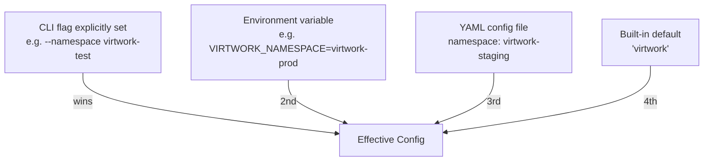

# Configuration Reference

Virtwork configuration flows through four sources, merged in priority order:

```
CLI flags  >  environment variables (VIRTWORK_*)  >  YAML config file  >  built-in defaults
```

This document is the authoritative reference: every flag, every environment variable, every YAML key, every ConfigMap entry, and every per-workload parameter. For the *summary*, see the top-level [README](../README.md#configuration). For the implementation, see `internal/config/config.go`.

## Quick Reference

| Surface | When to use |
|---|---|
| **CLI flags** | One-off overrides; whatever you type wins |
| **Environment variables** (`VIRTWORK_*`) | CI/CD pipelines; ConfigMap-driven in-cluster deployments |
| **YAML config file** (`--config path.yaml`) | Reproducible runs; expressing per-workload overrides |
| **Defaults** | Sensible behavior with no arguments at all |

---

## Global Persistent Flags

These apply to both `virtwork run` and `virtwork cleanup`.

| Flag | Env Var | YAML Key | Default | Description |
|---|---|---|---|---|
| `--namespace` | `VIRTWORK_NAMESPACE` | `namespace` | `virtwork` | Kubernetes namespace for VMs and supporting resources |
| `--kubeconfig` | `VIRTWORK_KUBECONFIG` | `kubeconfig` | _empty (in-cluster, then `~/.kube/config`)_ | Path to kubeconfig file (see [kubeconfig resolution](#kubeconfig-resolution)) |
| `--config` | — | — | _empty_ | Path to a YAML config file to merge in |
| `--verbose` | `VIRTWORK_VERBOSE` | `verbose` | `false` | Switch the logger from INFO to DEBUG |
| `--audit` | `VIRTWORK_AUDIT` | `audit` | `true` | Enable SQLite audit tracking |
| `--no-audit` | — | — | _unset_ | Hard override: disable audit tracking regardless of `--audit` / `VIRTWORK_AUDIT` |
| `--audit-db` | `VIRTWORK_AUDIT_DB` | `audit_db` | `virtwork.db` | Path to the audit SQLite file (use `/data/virtwork.db` in-cluster) |

**Audit precedence note:** `--no-audit` short-circuits everything. Otherwise, the `audit` boolean follows the standard chain. In-cluster, set `VIRTWORK_AUDIT=false` in the ConfigMap to disable.

---

## `virtwork run` Flags

| Flag | Env Var | YAML Key | Default | Description |
|---|---|---|---|---|
| `--workloads` | — | _(handled via `workloads` map per-key)_ | All nine workloads, sorted: `chaos-disk, chaos-network, chaos-process, cpu, database, disk, memory, network, tps` | Comma-separated list of workloads to deploy |
| `--vm-count` | — | `workloads.<name>.vm_count` | `1` | VMs per workload (multi-VM workloads multiply by `len(Roles())`, so 1 becomes 2 for network and tps) |
| `--cpu-cores` | `VIRTWORK_CPU_CORES` | `cpu_cores` / `workloads.<name>.cpu_cores` | `2` | CPU cores per VM (per-workload override beats global) |
| `--memory` | `VIRTWORK_MEMORY` | `memory` / `workloads.<name>.memory` | `2Gi` | Memory per VM |
| `--disk-size` | `VIRTWORK_DATA_DISK_SIZE` | `data_disk_size` | `10Gi` | Data-disk size for storage-backed workloads (disk, database, chaos-disk) |
| `--container-disk-image` | `VIRTWORK_CONTAINER_DISK_IMAGE` | `container_disk_image` | `quay.io/containerdisks/fedora:41` | Boot image for the VMs; set to the golden image for faster boot |
| `--dry-run` | `VIRTWORK_DRY_RUN` | `dry_run` | `false` | Print the VM YAML and exit; do not connect to a cluster |
| `--no-wait` | — | (sets `wait_for_ready=false`) | _unset_ | Skip readiness polling after VMs are created |
| `--timeout` | `VIRTWORK_TIMEOUT` | `timeout` | `600` | Readiness timeout in seconds |
| `--ssh-user` | `VIRTWORK_SSH_USER` | `ssh_user` | `virtwork` | Username for the in-VM user account (only created when at least one SSH credential is provided) |
| `--ssh-password` | `VIRTWORK_SSH_PASSWORD` | `ssh_password` | _empty_ | Password for the SSH user (plain-text in the VM spec — prefer keys) |
| `--ssh-key` | — | `ssh_authorized_keys` (YAML list) | _empty_ | Inline SSH public key; repeatable |
| `--ssh-key-file` | — | _(handled as inline key after reading)_ | _empty_ | Path to a public key file; repeatable |
| _(env only)_ | `VIRTWORK_SSH_AUTHORIZED_KEYS` | `ssh_authorized_keys` | _empty_ | Comma-separated list of inline keys (env-var form) |

---

## `virtwork cleanup` Flags

| Flag | Env Var | YAML Key | Default | Description |
|---|---|---|---|---|
| `--delete-namespace` | — | — | `false` | Also delete the namespace itself after deleting managed resources |
| `--run-id` | — | — | _empty_ | Limit cleanup to resources labeled `virtwork/run-id=<uuid>` |
| `--dry-run` | — | — | `false` | Print intent without actually deleting |

Global flags (`--namespace`, `--kubeconfig`, `--audit`, `--no-audit`, `--audit-db`, `--verbose`) also apply.

---

## Environment Variables (Alphabetical)

| Variable | Type | Default | Source | Description |
|---|---|---|---|---|
| `VIRTWORK_AUDIT` | bool | `true` | flag-bound | Enable audit tracking |
| `VIRTWORK_AUDIT_DB` | string | `virtwork.db` | flag-bound | Audit SQLite path |
| `VIRTWORK_CONTAINER_DISK_IMAGE` | string | `quay.io/containerdisks/fedora:41` | flag-bound | VM boot image |
| `VIRTWORK_CPU_CORES` | int | `2` | flag-bound | Default per-VM CPU cores |
| `VIRTWORK_DATA_DISK_SIZE` | string | `10Gi` | flag-bound | Default data disk size |
| `VIRTWORK_DRY_RUN` | bool | `false` | flag-bound | Default for `--dry-run` |
| `VIRTWORK_KUBECONFIG` | string | _empty_ | flag-bound | Kubeconfig path (takes precedence over `KUBECONFIG`; see [kubeconfig resolution](#kubeconfig-resolution)) |
| `VIRTWORK_MEMORY` | string | `2Gi` | flag-bound | Default per-VM memory |
| `VIRTWORK_NAMESPACE` | string | `virtwork` | flag-bound | Target namespace |
| `VIRTWORK_SSH_AUTHORIZED_KEYS` | string (csv) | _empty_ | env-only | Comma-separated SSH public keys |
| `VIRTWORK_SSH_PASSWORD` | string | _empty_ | flag-bound | SSH password |
| `VIRTWORK_SSH_USER` | string | `virtwork` | flag-bound | SSH username |
| `VIRTWORK_TIMEOUT` | int | `600` | flag-bound | Readiness timeout seconds |
| `VIRTWORK_VERBOSE` | bool | `false` | flag-bound | Verbose logging |
| `VIRTWORK_WAIT_FOR_READY` | bool | `true` | flag-bound | Inverse of `--no-wait` |
| `VIRTWORK_COMMAND` | string | _empty_ | deployment only | In-pod auto-run command: `run`, `cleanup`, or empty (sleep). Read by `entrypoint.sh`, not Viper. |
| `VIRTWORK_ARGS` | string | _empty_ | deployment only | Extra arguments when `VIRTWORK_COMMAND` is set. Read by `entrypoint.sh`, not Viper. |

`VIRTWORK_COMMAND` and `VIRTWORK_ARGS` are container entrypoint behavior — they tell `entrypoint.sh` whether to run virtwork immediately or to sleep until invoked via `oc exec`. See [deployment.md](deployment.md).

---

## YAML Config File

Full schema with every supported key:

```yaml
# Global defaults
namespace: virtwork-prod
container_disk_image: quay.io/opdev/virtwork-disk:latest    # set to golden image to skip first-boot package installs
data_disk_size: 20Gi
cpu_cores: 2
memory: 2Gi

# Cluster connection (omit to use in-cluster or ~/.kube/config)
kubeconfig: /etc/virtwork/kubeconfig

# Behavior
dry_run: false
verbose: false
wait_for_ready: true
timeout: 900

# SSH (optional — when omitted, no user account is created in the VM)
ssh_user: virtwork
ssh_password: ""              # prefer keys
ssh_authorized_keys:
  - ssh-ed25519 AAAAC3Nz... key-1
  - ssh-ed25519 AAAAC3Nz... key-2

# Audit
audit: true
audit_db: /data/virtwork.db

# Per-workload overrides (everything optional; unspecified keys inherit globals)
workloads:
  cpu:
    enabled: true              # explicitly enable (can be omitted; defaults to enabled)
    vm_count: 2
    cpu_cores: 4
    memory: 4Gi
  memory:
    vm_count: 1                # enabled by default when not specified
  disk:
    enabled: false             # skip this workload entirely
  database:
    cpu_cores: 2
    memory: 4Gi
  network:
    vm_count: 1                # creates 1 server + 1 client = 2 VMs
  tps:
    vm_count: 1                # creates 1 server + 1 client = 2 VMs
    params:
      file-size: "50M"         # default 10M
      iterations: "10"         # default 30
      duration: "30"           # default 60 (seconds per iteration)
  chaos-disk:
    params:
      mount: /mnt/data         # default /mnt/data
      fill-percent: "80"       # default 90
      fill-sleep: "120"        # default 60
      release-sleep: "60"      # default 30
  chaos-network:
    params:
      latency-ms: "250"        # default 100
      packet-loss-percent: "10"  # default 5.0
  chaos-process:
    params:
      signal: "SIGKILL"        # default SIGTERM
      interval: "15"           # default 30
      min-pid: "500"           # default 1000
```

### Per-workload `enabled` field

The `enabled` field controls whether a workload is deployed when listed in the `--workloads` flag. This provides a declarative way to disable workloads in YAML config without modifying command-line flags.

- **`enabled: true`** — workload is deployed (explicit)
- **`enabled: false`** — workload is skipped entirely; no VMs, services, or resources created
- **Field omitted** — workload is enabled by default (treated as `true`)

**Precedence:** The `--workloads` flag determines the candidate set; the YAML `enabled` field then filters it. For example:

```bash
virtwork run --workloads cpu,disk,network --config config.yaml
```

With `config.yaml`:
```yaml
workloads:
  disk:
    enabled: false
```

**Result:** Only `cpu` and `network` are deployed. `disk` is skipped despite being in the `--workloads` flag.

**Audit event:** When a workload is skipped due to `enabled: false`, an audit event of type `workload_skipped` is recorded with the message `Workload "name" disabled via config (enabled: false)`.

### Per-workload `params` keys

Each workload's `params` block accepts string-valued keys. The current parameters per workload:

| Workload | Key | Default | Effect |
|---|---|---|---|
| **tps** | `file-size` | `10M` | Size of the HTTP test file (suffix `K`/`M`/`G`) |
| **tps** | `iterations` | `30` | Number of test iterations |
| **tps** | `duration` | `60` | Seconds per iteration |
| **chaos-disk** | `mount` | `/mnt/data` | Mountpoint of the data disk to fill |
| **chaos-disk** | `fill-percent` | `90` | Target fill percentage |
| **chaos-disk** | `fill-sleep` | `60` | Seconds held at target fill |
| **chaos-disk** | `release-sleep` | `30` | Seconds empty before refilling |
| **chaos-network** | `latency-ms` | `100` | `netem` egress delay |
| **chaos-network** | `packet-loss-percent` | `5.0` | `netem` egress drop rate |
| **chaos-process** | `signal` | `SIGTERM` | Signal sent to victims |
| **chaos-process** | `interval` | `30` | Seconds between kills |
| **chaos-process** | `min-pid` | `1000` | Minimum PID considered eligible |

Workloads without entries above accept no per-workload `params` today (cpu, memory, disk, database, network).

---

## ConfigMap for In-Cluster Deployment

`deploy/configmap.yaml` ships the following defaults. Edit and `oc apply -k deploy/` to change behavior of an in-cluster pod.

| ConfigMap Key | Default | Notes |
|---|---|---|
| `VIRTWORK_NAMESPACE` | `virtwork` | The pod creates VMs in this namespace |
| `VIRTWORK_CONTAINER_DISK_IMAGE` | `quay.io/containerdisks/fedora:41` | Change to the golden image to speed up boot |
| `VIRTWORK_DATA_DISK_SIZE` | `10Gi` | |
| `VIRTWORK_CPU_CORES` | `2` | |
| `VIRTWORK_MEMORY` | `2Gi` | |
| `VIRTWORK_WAIT_FOR_READY` | `true` | |
| `VIRTWORK_TIMEOUT` | `600` | |
| `VIRTWORK_DRY_RUN` | `false` | |
| `VIRTWORK_VERBOSE` | `false` | |
| `VIRTWORK_AUDIT` | `true` | |
| `VIRTWORK_AUDIT_DB` | `/data/virtwork.db` | Mounted from the `virtwork-audit-data` PVC |
| `VIRTWORK_SSH_USER` | `virtwork` | |

`VIRTWORK_COMMAND` and `VIRTWORK_ARGS` are set directly in the Deployment `env:` (not the ConfigMap) so that updating them triggers a pod restart. See [deployment.md](deployment.md).

`deploy/secret.yaml` provides `VIRTWORK_SSH_PASSWORD` and `VIRTWORK_SSH_AUTHORIZED_KEYS` separately so that credentials are not in the ConfigMap.

---

## Priority Chain in Detail



### Kubeconfig resolution

The `kubeconfig` key has an additional resolution layer handled by `cluster.ResolveKubeconfigPath` before the connection is established:

```
--kubeconfig / VIRTWORK_KUBECONFIG  >  KUBECONFIG env var  >  in-cluster service-account  >  ~/.kube/config
```

1. **Explicit path** — `--kubeconfig` flag or `VIRTWORK_KUBECONFIG` env var (resolved via the standard Viper priority chain above). When set, in-cluster detection is skipped entirely.
2. **`KUBECONFIG` env var** — the standard Kubernetes variable. Checked only when no explicit path is provided.
3. **In-cluster service-account** — `rest.InClusterConfig()` is attempted only when *no* kubeconfig path is resolved from steps 1–2.
4. **Default loading rules** — `~/.kube/config` (via `clientcmd` default loading rules) is the final fallback.

This means setting `VIRTWORK_KUBECONFIG` in a CI/CD pipeline or ConfigMap will always win over `KUBECONFIG`, and any explicit path will bypass in-cluster detection — even when running inside a pod.

How it works in code (`internal/config/config.go` → `LoadConfig`):

1. `SetDefaults(v)` seeds Viper with the built-in defaults.
2. `v.SetEnvPrefix("VIRTWORK")` + `v.AutomaticEnv()` enables automatic env-var binding (with `-` ↔ `_` replacement so `--data-disk-size` ↔ `VIRTWORK_DATA_DISK_SIZE`).
3. If `--config <path>` is set, `v.ReadInConfig()` merges the YAML file (overrides env and defaults).
4. `bindFlagIfSet(...)` walks each known flag and copies the value into Viper *only if* the flag was explicitly set on the command line. This makes CLI flags the top of the stack without clobbering env/YAML values from defaults.
5. The `Config` struct is populated from Viper's effective view.

Workload-specific config (`workloads.<name>.*`) is parsed as a separate map in step 5 via `v.UnmarshalKey("workloads", ...)` — it only exists in YAML; there is no env-var or flag form.

The `--no-audit` flag is checked separately by `initAuditor` in `cmd/virtwork/main.go` and short-circuits the standard chain.

---

## For Contributors

- All config field definitions live in `internal/config/config.go` — `WorkloadConfig` struct, `Config` struct, `SetDefaults`, `BindFlags`, `LoadConfig`.
- The mapstructure tag on each field is the YAML key name (e.g., `mapstructure:"data-disk-size"` → YAML key `data_disk_size` after the `_`/`-` replacement). Match this convention when adding new fields.
- Per-workload `params` are surfaced into the workload as `WorkloadConfig.Params map[string]string`. New chaos / multi-VM knobs go here so they're uniformly addressable from YAML.
- When adding a new env var, prefer letting Viper bind it automatically rather than hand-rolling `os.Getenv` (see `VIRTWORK_SSH_AUTHORIZED_KEYS` in `resolveSSHKeys` for the one current exception, driven by the comma-split list semantics).
- Update this document, the ConfigMap default list, and the per-workload `params` table whenever you add a new knob.

## Related Docs

- [README.md](../README.md#configuration) — configuration summary in the main project README
- [chaos-workloads.md](chaos-workloads.md) — narrative description of how chaos params shape workload behavior
- [deployment.md](deployment.md) — ConfigMap + Secret + Deployment env semantics
- [development.md](development.md) — adding new workloads (including new params)
- [audit-schema.md](audit-schema.md) — audit-related configuration consequences
