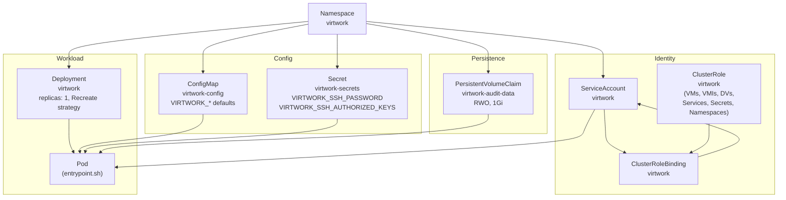

# OpenShift Deployment

Virtwork can run as a pod on the cluster it operates against, using the Kustomize manifests in [`deploy/`](../deploy). This is the right deployment model when you want virtwork to be reachable from `oc exec`, scheduled by CI, or driven by a GitOps workflow.

For the smaller "run from my laptop with my kubeconfig" mode, just build and execute the binary — no manifests are needed.

## What `oc apply -k deploy/` Creates



| Resource | File | Purpose |
|---|---|---|
| Namespace `virtwork` | `namespace.yaml` | Isolation boundary for virtwork-managed resources |
| ServiceAccount `virtwork` | `serviceaccount.yaml` | Identity the pod runs as |
| ClusterRole + ClusterRoleBinding `virtwork` | `rbac.yaml` | Permissions to manage VMs, VMIs, DataVolumes, Services, Secrets, Namespaces — cluster-scoped because Namespaces themselves are cluster-scoped |
| ConfigMap `virtwork-config` | `configmap.yaml` | Default `VIRTWORK_*` env vars |
| Secret `virtwork-secrets` | `secret.yaml` | SSH credentials (kept out of the ConfigMap) |
| PersistentVolumeClaim `virtwork-audit-data` | `pvc.yaml` | 1Gi RWO claim mounted at `/data` for the audit SQLite file |
| Deployment `virtwork` | `deployment.yaml` | The pod itself |

The Kustomization (`deploy/kustomization.yaml`) applies `app.kubernetes.io/name: virtwork` and `app.kubernetes.io/managed-by: virtwork` labels to every resource.

## Deploy

```bash
oc apply -k deploy/

# Verify
oc get all,configmap,secret,pvc -n virtwork
```

The Deployment uses `strategy.type: Recreate` because the audit PVC is `ReadWriteOnce` — a rolling update would attempt to schedule two pods simultaneously and the new pod would fail to bind the volume.

## Container Behavior: `VIRTWORK_COMMAND` and `VIRTWORK_ARGS`

The container's behavior is governed by two environment variables defined directly in the Deployment (not the ConfigMap, so that changing them rolls the pod):

| Env | Effect |
|---|---|
| `VIRTWORK_COMMAND` empty (default) | Pod runs `sleep infinity`. Use `oc exec` to run virtwork commands by hand. |
| `VIRTWORK_COMMAND=run` | Pod auto-executes `virtwork run $VIRTWORK_ARGS` on start. |
| `VIRTWORK_COMMAND=cleanup` | Pod auto-executes `virtwork cleanup $VIRTWORK_ARGS` on start. |

The entrypoint script ([`entrypoint.sh`](../entrypoint.sh)) validates `VIRTWORK_COMMAND` (only `run` and `cleanup` are accepted) and `exec`s into virtwork. Pod stdout/stderr ends up in the container log.

**Important:** `VIRTWORK_ARGS` is intentionally unquoted to allow space-delimited tokens (`"--workloads cpu,memory --vm-count 2"`). As a consequence, **no argument value can contain a space.**

### Interactive use

```bash
oc exec -it deploy/virtwork -- virtwork run --dry-run
oc exec -it deploy/virtwork -- virtwork run --workloads cpu,memory
oc exec -it deploy/virtwork -- virtwork cleanup
oc exec -it deploy/virtwork -- sqlite3 /data/virtwork.db "SELECT run_id, command, status, started_at FROM audit_log ORDER BY id DESC LIMIT 5"
```

### Auto-execute on pod start

```bash
oc set env deploy/virtwork VIRTWORK_COMMAND=run VIRTWORK_ARGS="--workloads cpu,memory --vm-count 2"
```

The deployment rolls the pod, which executes virtwork and exits. The audit row persists on the PVC. For repeatable scheduled runs, drive `VIRTWORK_COMMAND` / `VIRTWORK_ARGS` from a CronJob or GitOps tool rather than the Deployment directly.

## Image Pinning

The Deployment ships pinned to a semantic version (`quay.io/opdev/virtwork:v0.0.1`) for reproducibility. Bump the tag when upgrading.

```yaml
containers:
  - name: virtwork
    image: quay.io/opdev/virtwork:v0.0.1   # update on upgrade
    imagePullPolicy: IfNotPresent
```

For development you may pin to `:latest` instead, but be aware that `IfNotPresent` plus `:latest` can pin a node to an older copy of the image until it's pulled again. Either bump the tag, or set `imagePullPolicy: Always` for floating tags.

The container image is built from [`Dockerfile`](../Dockerfile) (multi-stage: `golang:1.25-bookworm` builder for CGO + `ubi9/ubi-minimal` runtime with `sqlite-libs`). A CI variant lives at [`Dockerfile.ci`](../Dockerfile.ci).

```bash
podman build -t quay.io/opdev/virtwork:vX.Y.Z .
podman push quay.io/opdev/virtwork:vX.Y.Z
```

Then update `deploy/deployment.yaml` and `oc apply -k deploy/`.

### Using the Golden Container Disk Image

The golden image at `quay.io/opdev/virtwork-disk:latest` pre-installs every workload's tools so VMs boot ready-to-run. To make it the default for an in-cluster deployment, set the ConfigMap key:

```bash
oc set data configmap/virtwork-config -n virtwork VIRTWORK_CONTAINER_DISK_IMAGE=quay.io/opdev/virtwork-disk:latest
```

The Deployment uses `envFrom` to pull all ConfigMap keys into the pod, so the change takes effect on the next `virtwork run`. No pod restart needed. See [../build/golden-image/README.md](../build/golden-image/README.md) for build instructions.

## RBAC Scope

The ClusterRole `virtwork` grants:

| API Group | Resources | Verbs | Why |
|---|---|---|---|
| `""` (core) | `namespaces` | `create`, `get`, `delete` | `EnsureNamespace`; `cleanup --delete-namespace` |
| `kubevirt.io` | `virtualmachines` | `create`, `delete`, `get`, `list` | Full VM lifecycle |
| `kubevirt.io` | `virtualmachineinstances` | `get`, `list` | Readiness polling (`GetVMIPhase`) |
| `cdi.kubevirt.io` | `datavolumes` | `create`, `delete`, `get`, `list` | DataVolumes are created via embedded `DataVolumeTemplates` in VMs |
| `""` (core) | `services` | `create`, `delete`, `get`, `list` | Multi-VM workloads (network, tps) need ClusterIP Services |
| `""` (core) | `secrets` | `create`, `delete`, `get`, `list` | Cloud-init userdata Secrets (one per VM) |

This is a ClusterRole — not a Role — because `namespaces` are cluster-scoped. Permissions are intentionally broad to support cross-namespace test setups; tighten the binding to a single namespace if your environment requires it.

## Sizing

The Deployment's defaults (`requests: 64Mi / 100m`, `limits: 256Mi / 500m`) are sized for the orchestrator process itself, not the VMs it creates. Bump the limits if:

- You deploy all nine workloads simultaneously (11 VMs of plumbing in one pod) — concurrent VM-create goroutines and audit writes consume modestly more memory.
- You consume the audit DB with long-running queries from within the pod.

The VMs themselves are sized via `--cpu-cores`, `--memory`, and per-workload YAML overrides; their resource requests come from the VirtualMachine spec, not the virtwork pod.

## DataVolume Names

When you list DataVolumes inside the namespace, you'll see entries like:

```
$ oc get dv -n virtwork
NAME                             PHASE       AGE
virtwork-disk-data-virtwork-disk-0          Succeeded   3m
virtwork-database-data-virtwork-database-0  Succeeded   3m
virtwork-chaos-disk-data-virtwork-chaos-disk-0  Succeeded  3m
```

The suffix (`-virtwork-disk-0`, `-virtwork-chaos-disk-0`) comes from `namespaceDataVolumes` in `cmd/virtwork/main.go`. Each `VMCount > 1` deployment gets its own uniquely-named DataVolume so multiple VMs of the same workload type don't collide on a single namespace-scoped DV name. The base name (`virtwork-disk-data`, etc.) is what the workload declares in its `DataVolumeTemplates()` method; the orchestrator appends the VM name.

## Persisting the Audit Database

The audit DB lives at `/data/virtwork.db` in-pod, mounted from the `virtwork-audit-data` PVC. The default PVC is 1Gi RWO — plenty for tens of thousands of executions.

The PVC is intentionally separate from the Deployment so that `oc apply -k deploy/` upgrades preserve audit history.

To inspect from outside the cluster:

```bash
# Copy the DB out
oc cp virtwork/$(oc get pod -n virtwork -l app.kubernetes.io/name=virtwork -o name | head -1 | cut -d/ -f2):/data/virtwork.db ./virtwork.db
sqlite3 virtwork.db "SELECT run_id, command, status, started_at FROM audit_log ORDER BY id DESC LIMIT 10"
```

Or query in-place:

```bash
oc exec -n virtwork deploy/virtwork -- sqlite3 /data/virtwork.db "SELECT run_id, command, status, started_at FROM audit_log ORDER BY id DESC LIMIT 10"
```

See [audit-schema.md](audit-schema.md) for the full schema and more queries.

## Security Context

The pod runs:

- `runAsNonRoot: true`
- `seccompProfile.type: RuntimeDefault`
- `allowPrivilegeEscalation: false`
- `capabilities.drop: [ALL]`

These are pod- and container-level defaults that the security review process expects. Override only if you have a specific need.

The Secret (`virtwork-secrets`) carries the SSH password and authorized-keys list. It is mounted via `envFrom` so the values appear as env vars inside the pod. **Do not store SSH passwords as plain text in production** — prefer authorized keys via `VIRTWORK_SSH_AUTHORIZED_KEYS`, and even then treat the secret as sensitive in your cluster RBAC.

## Uninstalling

```bash
# Just the pod and identity, keeping the audit history
oc delete deployment virtwork -n virtwork

# Or the whole thing including the namespace and PVC
oc delete -k deploy/
```

`oc delete -k deploy/` removes everything in the Kustomize set, including the PVC. If you want to keep the audit history across uninstalls, omit `pvc.yaml` from the deletion or delete resources individually.

## Related Docs

- [README.md](../README.md#openshift-deployment) — the high-level deployment summary
- [configuration.md](configuration.md) — every ConfigMap key with its meaning and default
- [audit-schema.md](audit-schema.md) — what's in the PVC-backed SQLite file
- [chaos-workloads.md](chaos-workloads.md) — running chaos workloads from an in-cluster pod
- [../build/golden-image/README.md](../build/golden-image/README.md) — building and using the optional golden container disk image
