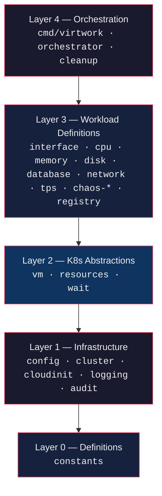
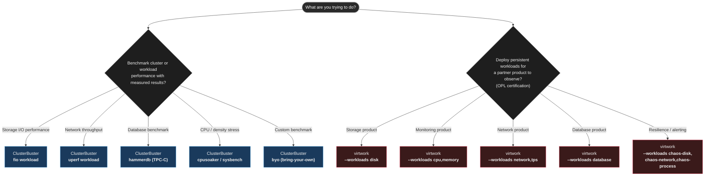
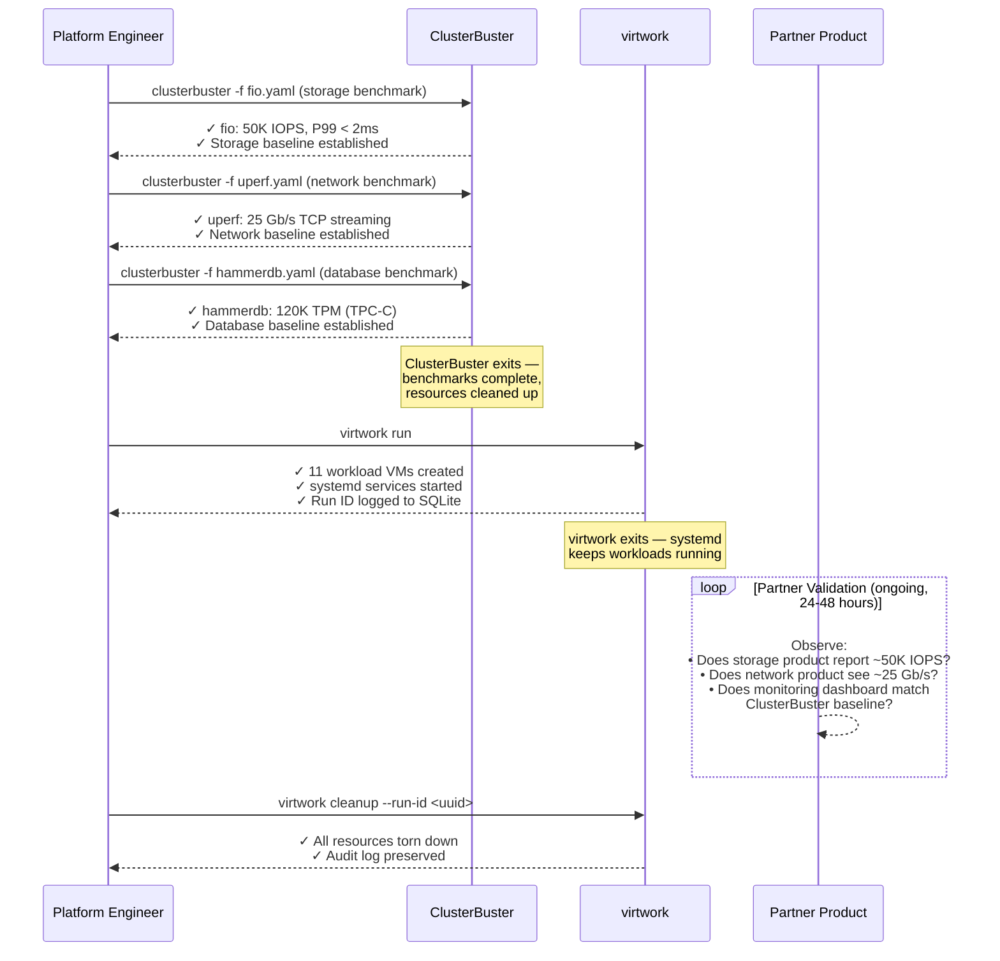

# virtwork vs ClusterBuster

> A technical comparison of two Red Hat ecosystem tools that run the same application-level workloads (fio, network benchmarks, database load) — one as time-bounded benchmarks that measure cluster performance, the other as permanent systemd services that generate signals for partner products to observe.

---

## 1. What Each Project Is — First Principles

The fastest way to understand the difference: **what question does each tool answer?**

| Tool | Core Question |
|---|---|
| **ClusterBuster** | *"How does the cluster perform when running real application workloads (fio, uperf, hammerdb) at scale?"* |
| **virtwork** | *"Does my monitoring, storage, or network product correctly observe and handle real, persistent VM workloads?"* |

These tools run many of the same underlying programs — fio, network throughput benchmarks, database load generators — but for fundamentally different purposes. One is a **benchmark** that measures workload performance on the cluster. The other is a **signal generator** that produces workload signals for partner products to observe. ClusterBuster cares about the measurement. virtwork cares about who is watching.

---

## 2. What Each Project Is — In Detail

### ClusterBuster

A **workload orchestration and benchmarking framework** written in Python, maintained by Red Hat's Performance and Scalability organization. It deploys diverse workloads across pods, KubeVirt VMs, and sandboxed containers, synchronizes their start times, collects performance metrics, and generates reports. The original motivation was stress testing clusters at "500 pods per node" density.

**Core design principles:**

- **Synchronized execution** — A sync controller coordinates workload start times across all pods/VMs within ~0.1 seconds. This precision enables valid benchmark comparisons: all instances begin under identical conditions.
- **Time-bounded** — Every workload runs for a configured `workloadruntime` (in seconds), collects results, and exits. The tool manages the full lifecycle: create, run, measure, report, teardown.
- **Multi-runtime** — Deploys workloads as Kubernetes Pods, KubeVirt VMs, ReplicaSets, or Deployments. Switch between runtimes with a single option (`deployment-type: vm`).
- **Results collection** — Collects JSON-formatted results from every workload instance, optional Prometheus metrics snapshots, and generates text reports via `clusterbuster-report`. No external Elasticsearch dependency required.
- **Plugin architecture** — Workloads are Python classes subclassing `WorkloadBase` with a `@register` decorator. Adding a new workload requires implementing `arglist()` (or `server_arglist()` / `client_arglist()` for client-server patterns) and optionally an in-pod script subclassing `clusterbuster_pod_client`.

**15+ workload plugins:**

| Category | Workloads | Tools |
|---|---|---|
| **CPU / System** | cpusoaker, sysbench | Custom CPU soaker; sysbench (CPU, memory, threads, mutex, fileio modes) |
| **Storage I/O** | fio | Flexible I/O tester — configurable block size, I/O depth, patterns |
| **Network** | uperf, server | uperf TCP/UDP streaming; client-server messaging |
| **Database** | hammerdb | TPC-C / TPROC-C benchmarks against PostgreSQL or MariaDB |
| **Memory** | memory | Custom memory allocation/scanning workload |
| **Filesystem** | files | Many-small-files creation and metadata stress |
| **Logging** | logger | Log message generation at configurable rates |
| **Custom** | byo | Bring-your-own workload (arbitrary executable with JSON output) |
| **Utility** | pausepod, sleep, synctest, waitforever, failure | Testing and infrastructure validation |

**VM support:** ClusterBuster uses pre-built containerdisk qcow2 images (`clusterbuster-vm`, `clusterbuster-hammerdb-vm`) with workload tools pre-installed via `virt-customize`. VM resources are configurable via `vm-cores` and `vm-memory` options. The `deployment-type: vm` option switches the entire test from pods to KubeVirt VMs.

**Configuration:** YAML job files passed via `clusterbuster -f <filename>`. Example:

```yaml
options:
  workload: fio
  workloadruntime: 10
  replicas: 4
  antiaffinity: true
  cleanup: true
  exit-at-end: true
```

**What it does NOT do:** leave workloads running permanently for an external product to observe. Every ClusterBuster run has a defined duration — when `workloadruntime` expires, results are collected and resources are cleaned up. The tool is the observer, not the signal source.

---

### virtwork

A **one-shot VM workload deployment CLI** written in Go. It creates KubeVirt VMs on OpenShift with CNV installed and launches **continuous, persistent workloads inside them via systemd**. Then it exits.

**Key architectural decision from the README:**
> virtwork is a one-shot deployment tool — it creates resources and exits. Workload lifecycle management is handled by systemd inside each VM.

#### virtwork layered architecture



**Nine workloads — all running as systemd services:**

| Workload | Tool | What It Generates | Partner Validation Use |
|---|---|---|---|
| `cpu` | `stress-ng --cpu 0 --cpu-load 100 --cpu-method all` | Continuous CPU pressure across all cores | Monitoring agent scrapes CPU% correctly |
| `memory` | `stress-ng --vm 1 --vm-bytes 80% --vm-method all` | Sustained memory pressure | Memory metrics, pressure alerts, OOM handling |
| `disk` | `fio` with mixed random + sequential profiles | Mixed I/O patterns on a dedicated data disk | Storage agent reports IOPS, throughput, latency |
| `database` | PostgreSQL + `pgbench -c 10 -j 2 -T 300` | Realistic OLTP database transactions | DB-aware monitoring, query performance tracking |
| `network` | `iperf3 -P 4 -t 60 --bidir` (server + client VM pairs) | Bidirectional throughput between VMs | CNI/network product correct routing, throughput reporting |
| `tps` | `netperf` + Python HTTP server (server + client VM pairs) | Multi-port HTTP throughput | Network product handles mixed protocol load |
| `chaos-disk` | `fallocate`/`dd` fill-release loop | Sustained disk-pressure events on a data disk | Storage alerts on capacity, product resilience |
| `chaos-network` | `tc` + `netem` qdisc | Injected latency and packet loss on egress | Network product detects degradation |
| `chaos-process` | shell + `ps`/`kill` | Random process termination inside the VM | Monitoring alerts on process death, recovery |

All workloads survive VM reboots and auto-restart on failure. virtwork does not collect metrics, generate reports, or benchmark performance. It generates the signals and walks away.

---

## 3. Side-by-Side Comparison

| Dimension | ClusterBuster | virtwork |
|---|---|---|
| **Primary purpose** | Benchmark cluster and workload performance | Deploy persistent VM workloads for partner product validation |
| **Workload lifecycle** | Time-bounded (`workloadruntime: N` seconds) — run, measure, teardown | Permanent — deploy systemd services, exit, workloads run indefinitely |
| **Who measures** | ClusterBuster itself (collects JSON results, Prometheus metrics) | External partner products (storage, monitoring, network) |
| **Underlying tools** | fio, uperf, hammerdb, sysbench, cpusoaker | fio, iperf3, pgbench, stress-ng, netperf, tc/netem |
| **Tool overlap** | **fio** (storage I/O) — both tools use it | **fio** (storage I/O) — both tools use it |
| **Runtime targets** | Pods, KubeVirt VMs, ReplicaSets, Deployments | KubeVirt VMs only |
| **Orchestration** | Sync controller coordinates start within ~0.1s | No sync — workloads start independently via cloud-init |
| **Workload mechanism** | Binary executed in pod container or VM process | systemd service installed via cloud-init, persists across reboots |
| **Results** | JSON workload results + Prometheus metrics + text reports | SQLite audit database + labels on K8s resources (no workload metrics) |
| **Who runs it** | Red Hat Performance & Scale engineers, cluster operators | OPL partners validating storage, monitoring, network products |
| **Language** | Python (PyYAML, kubernetes client) | Go (controller-runtime client) |
| **Config model** | YAML job files via `clusterbuster -f` | CLI flags → env vars → YAML config → defaults (Viper) |
| **Plugin system** | Python `@register` decorator + `WorkloadBase` subclass | Go `Workload` / `MultiVMWorkload` interfaces + registry |
| **Custom workloads** | `byo` (bring-your-own) — arbitrary executable with JSON output | `--from-catalog` — systemd service files + YAML manifest |
| **VM images** | Pre-built containerdisk qcow2 (`clusterbuster-vm`) | Standard Fedora containerdisk or golden image |
| **Scale heritage** | "500 pods per node" density testing (2019) | OpenShift Partner Labs VM workload generation |
| **Chaos workloads** | `failure` (pod failure testing) | chaos-disk, chaos-network, chaos-process (in-VM fault injection) |
| **Deployment** | External to cluster (binary/script) | Binary or in-cluster Kustomize pod |
| **CI integration** | `run-perf-ci-suite` for multi-workload matrix execution | Makefile targets (`make ci`, `make verify`) |
| **Cleanup** | `--cleanup`, `--precleanup`, `--cleanup-always` flags | `virtwork cleanup` with `--run-id` targeting |
| **Maturity** | Active, Red Hat Performance & Scalability, Apache 2.0 | Active development, Red Hat/opdev, Apache 2.0 |

---

## 4. The Fundamental Difference — Benchmark vs. Signal Generator

The cleanest way to state the core distinction:

> **ClusterBuster runs workloads to measure their performance.** Every run has a defined duration, a sync controller for precise timing, and results collection that captures IOPS, throughput, latency, and CPU time. The tool is both the deployer and the observer.
>
> **virtwork runs workloads to produce signals for other tools to observe.** It deploys and exits. What happens next — whether a monitoring agent scrapes the right CPU metric, whether a storage product reports the correct IOPS, whether a network product detects injected latency — is the partner product's problem, not virtwork's.

Using **The Analogy Method**:

- **ClusterBuster** is like a **controlled lab experiment** — precise conditions, synchronized timing, instruments measuring the subject directly, results collected and published, apparatus dismantled after the experiment concludes.
- **virtwork** is like a **field deployment of weather stations** — instruments installed permanently in the environment, producing continuous data streams (temperature, wind speed, barometric pressure) for external observation systems to consume. The deployer sets them up and leaves. The weather stations don't report their own data — the meteorological service's dashboards do.

**The "same fio, different purpose" insight:** Both tools can run fio inside a KubeVirt VM. ClusterBuster runs fio for 10 seconds, collects the IOPS/throughput/latency numbers, and reports them. virtwork runs fio as a systemd service that restarts forever, and expects a partner's storage monitoring product to detect and report those same numbers in its own dashboard. Same binary, same VM, orthogonal intent.

**The sync controller reveals purpose:** ClusterBuster's sync controller coordinates all workload instances to start within ~0.1 seconds of each other. This precision matters for benchmarks — if half the fio instances start 30 seconds late, the results are invalid. virtwork has no sync controller because it doesn't need one. When workloads run forever, it doesn't matter whether they start simultaneously or five minutes apart.

---

## 5. Overlaps

Despite the fundamental difference in lifecycle and intent, the overlap between these two tools is substantial — more than with kube-burner or kubevirt-benchmark:

1. **Both run fio** — the single most direct overlap. Both tools deploy fio for storage I/O testing inside the same runtime (KubeVirt VMs)
2. **Both run network throughput benchmarks** — ClusterBuster uses uperf; virtwork uses iperf3. Different tools, same measurement category
3. **Both run database load generators** — ClusterBuster uses hammerdb (TPC-C); virtwork uses pgbench. Both target PostgreSQL
4. **Both support KubeVirt VMs** — ClusterBuster via `deployment-type: vm`; virtwork exclusively
5. **Both support custom workloads** — ClusterBuster's `byo` (bring-your-own); virtwork's `--from-catalog` (catalog system)
6. **Both support client-server patterns** — ClusterBuster's `server` workload and uperf client-server; virtwork's `network` (iperf3) and `tps` (netperf) server/client VM pairs
7. **Both are from Red Hat** — ClusterBuster from Performance & Scalability; virtwork from opdev (OpenShift Partner Labs)
8. **Both support cleanup** — both track and remove created resources

**The critical distinction within the overlap:** when ClusterBuster runs fio inside a VM, it collects the results (IOPS, throughput, latency percentiles) and reports them. When virtwork runs fio inside a VM, it doesn't collect anything — it expects a partner's storage product to observe and report those metrics. The fio process is identical. The purpose is opposite.

**Runtime scope:** ClusterBuster supports pods, VMs, ReplicaSets, and Deployments — it's a general-purpose cluster benchmarking tool that added VM support. virtwork only targets VMs — it was built specifically for OpenShift Virtualization partner validation.

---

## 6. Use Case Decision Guide



### When ClusterBuster is the right tool

- You need to **measure** workload performance on a cluster — not just run workloads, but collect and report results
- You need synchronized execution across many instances for valid benchmark comparisons
- You need to run benchmarks in both pods and VMs to compare runtime overhead
- You need CI-integrated performance regression testing with `run-perf-ci-suite`
- You need Prometheus metrics collection during benchmark runs
- You need TPC-C database benchmarking (hammerdb) or filesystem metadata stress testing (files)
- You're benchmarking storage, network, or compute performance for capacity planning or hardware evaluation

### When virtwork is the right tool

- You're a Red Hat technology partner validating a product on OpenShift Partner Labs (OPL)
- Your product needs **real, sustained workloads** to test against — not time-bounded benchmarks
- You need workloads to survive VM reboots and run indefinitely as systemd services
- You want minimal config and a fast path: `virtwork run` and you're done
- You need chaos workloads that inject failures *inside* VMs to test your product's alerting and recovery logic
- The goal is product certification, PoC, or demo — not performance measurement
- You need audit traceability per-run via SQLite (`--run-id` targeting for cleanup)

---

## 7. Benchmarking vs. Signal Generation — Same Tools, Different Purpose

This is where the comparison becomes most interesting. Both tools can deploy fio inside a KubeVirt VM. The table below shows what each tool does with the overlapping workload domains:

**What ClusterBuster measures (the benchmark):**

| Domain | Workload | What ClusterBuster Reports |
|---|---|---|
| **Storage** | fio | IOPS, throughput (MB/s), latency percentiles (P50/P95/P99), CPU time |
| **Network** | uperf | Bandwidth (Gb/s), message rate, TCP/UDP latency |
| **Database** | hammerdb (TPC-C) | Transactions per minute (TPM), new orders per minute (NOPM) |
| **CPU** | cpusoaker, sysbench | Operations per second, thread scaling efficiency |
| **Memory** | memory | Allocation throughput, scan rates |

**What virtwork generates (the signal for partner products to observe):**

| Domain | Workload | What Partner Products Must Observe |
|---|---|---|
| **Storage** | fio (disk workload) | Monitoring agent scrapes IOPS/throughput; storage product reports latency; alerts on degradation |
| **Network** | iperf3, netperf (network, tps) | CNI/network product correctly routes traffic; reports throughput; detects chaos-network packet loss |
| **Database** | pgbench (database) | Monitoring tracks query latency and transaction count; DB observer validates performance |
| **CPU** | stress-ng (cpu) | Dashboards show CPU%; monitoring product fires pressure alerts |
| **Memory** | stress-ng (memory) | Dashboards show memory%; OOM pressure alerts fire; scaling rules trigger |
| **Chaos** | chaos-disk, chaos-network, chaos-process | Alerts on disk capacity, network degradation, process death; product initiates remediation |

The key insight: **ClusterBuster asks "what is the IOPS?" virtwork asks "does your product see the IOPS?"** ClusterBuster is the instrument. virtwork is the signal source that somebody else's instrument must detect.

---

## 8. Composing Both Tools — Baseline Then Sustain

The two tools sequence naturally: ClusterBuster establishes a performance baseline, then virtwork deploys sustained signals for partner validation.



**The pipeline flow:**

1. **Baseline measurement** (ClusterBuster, 10–30 min per workload) — Establish quantitative performance baselines for storage, network, and database on the cluster. These numbers become the ground truth.
2. **Signal deployment** (virtwork, seconds) — Deploy permanent workloads that generate sustained versions of the same I/O patterns ClusterBuster just measured. VMs run fio, iperf3, pgbench, and chaos injectors as systemd services.
3. **Partner validation** (24–48 hours) — Partner product team verifies their dashboards show metrics consistent with ClusterBuster's baselines. If ClusterBuster measured 50K IOPS and the partner's storage product reports 50K IOPS, the product is correctly observing.
4. **Cleanup** (virtwork, minutes) — Remove all resources by run ID, preserve audit trail.

ClusterBuster answers "what should the numbers be?" virtwork provides the sustained signal so a partner product can prove it sees those numbers.

---

## 9. Key Config Reference

### ClusterBuster YAML job files

```yaml
# Storage I/O benchmark (fio)
options:
  workload: fio
  workloadruntime: 10
  replicas: 4
  antiaffinity: true
  cleanup: true
  exit-at-end: true
```

```yaml
# Network benchmark (uperf)
options:
  workload: uperf
  workloadruntime: 30
  uperf-msg-size: 8192
  uperf-test-type: stream
  uperf-proto: tcp
  replicas: 4
  antiaffinity: true
  cleanup: true
```

```yaml
# Database benchmark (hammerdb TPC-C)
options:
  workload: hammerdb
  workloadruntime: 180
  hammerdb-driver: pg
  hammerdb-benchmark: tpcc
  hammerdb-virtual-users: 4
  hammerdb-rampup: 1
  replicas: 2
  vm-cores: 5
  vm-memory: "8Gi"
  cleanup: true
  exit-at-end: true
```

```yaml
# VM deployment (any workload on KubeVirt VMs)
options:
  workload: sleep
  deployment-type: vm
  vm-cores: 2
  requests: "memory=2Gi"
  replicas: 2
  namespaces: 1
  cleanup: true
  exit-at-end: true
```

**Invocation:** `clusterbuster -f <filename.yaml>`

**Common options:** `--cleanup` (delete resources after), `--precleanup` (delete before), `--cleanup-always` (delete even on failure), `--antiaffinity` (spread across nodes), `--sync` (synchronized start, default on), `--exit-at-end` (terminate after completion).

### virtwork YAML config

```yaml
namespace: virtwork-prod
container_disk_image: quay.io/containerdisks/fedora:42
data_disk_size: 20Gi
ssh_user: virtwork
ssh_authorized_keys:
  - ssh-ed25519 AAAA...

workloads:
  cpu:
    enabled: true
    vm_count: 2
    cpu_cores: 4
    memory: 4Gi
  memory:
    enabled: true
  disk:
    enabled: true
  database:
    enabled: true
    cpu_cores: 2
    memory: 4Gi
  network:
    enabled: true    # creates server + client VM pairs
  tps:
    enabled: true
    params:
      file-size: "50M"
  chaos-disk:
    enabled: true
  chaos-network:
    enabled: true
  chaos-process:
    enabled: true
```

---

## 10. Conclusion

ClusterBuster and virtwork run many of the same workload tools — fio, network throughput benchmarks, database load generators — inside the same runtime (KubeVirt VMs on OpenShift). They even come from adjacent teams within Red Hat's ecosystem. But they answer different questions, and neither renders the other redundant.

ClusterBuster answers: *what is the performance?* Every run is a controlled experiment — synchronized start, defined duration, measured results, apparatus teardown. It reports IOPS, throughput, transactions per minute, and latency percentiles. The tool is both the deployer and the observer. When ClusterBuster runs fio and reports 50K IOPS, that number is the deliverable.

virtwork answers: *does your product see the performance?* Every deployment is a permanent installation — systemd services, indefinite runtime, no results collection. It produces the same I/O patterns, the same CPU pressure, the same network throughput — but does not measure them. When virtwork runs fio and a partner's storage product reports 50K IOPS in its dashboard, that observation is the deliverable.

The "same fio, different purpose" pattern is the clearest illustration: both tools deploy the same binary inside the same VM type. ClusterBuster measures fio's output for 10 seconds and generates a performance report. virtwork leaves fio running as a systemd service and expects a partner product to detect, report, and alert on its output for 48 hours. Same workload tool. Opposite intent.

Used together, they form a complete validation pipeline:
1. ClusterBuster establishes quantitative performance baselines
2. virtwork deploys sustained versions of those workloads for partner products to observe
3. Partner products prove their dashboards match ClusterBuster's baselines
4. Both tools contribute distinct, non-overlapping value to the same certification workflow

---

## 11. References

- [ClusterBuster GitHub](https://github.com/redhat-performance/clusterbuster)
- [virtwork GitHub](https://github.com/opdev/virtwork)
- [OpenShift Partner Lab Overview](https://connect.redhat.com/en/blog/the-openshift-partner-lab)
- [Red Hat Blog: Improving performance of multiple I/O threads for OpenShift Virtualization](https://www.redhat.com/en/blog/Improving-performance-of-multiple-I/O-threads-for-red-hat-openshift-virtualization)
- [Red Hat Blog: Behind the scenes — OpenShift Virtualization Performance and Scale](https://www.redhat.com/en/blog/behind-scenes-introducing-openshift-virtualization-performance-and-scale)
- [Red Hat Blog: KubeVirt Scale Test — Creating 400 VMIs Per Node](https://www.redhat.com/en/blog/kubevirt-scale-test-creating-400-vmis-per-node)
- [KubeVirt Official Documentation](https://kubevirt.io/)
