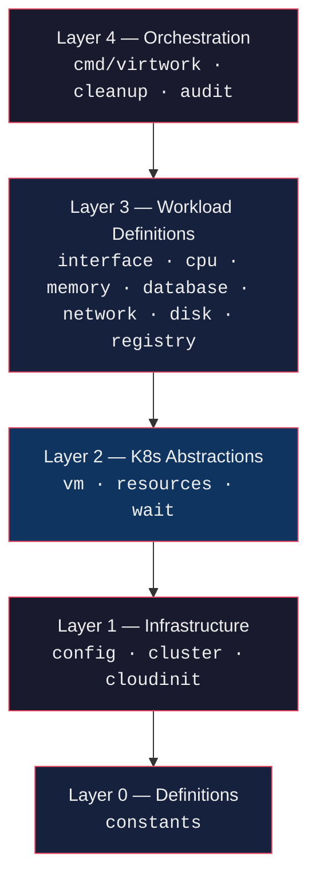
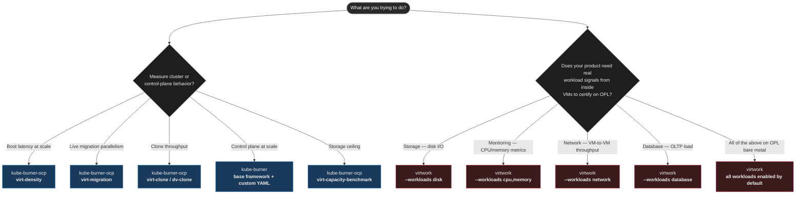
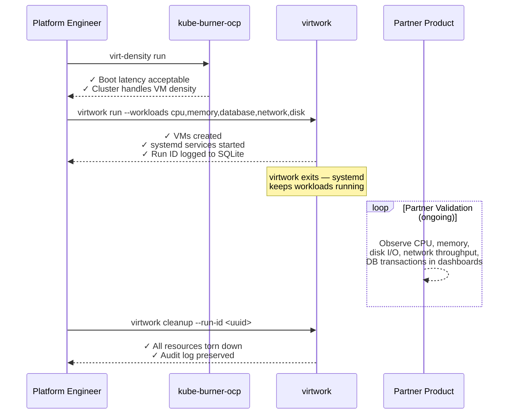

# virtwork vs kube-burner 

> A technical comparison of two tools for OpenShift Virtualization testing — one measures how OpenShift performs under VM lifecycle operations (boot, clone, restart, etc), and the other for generating workloads inside VMs.

---

## 1. What Each Project Is — First Principles

The fastest way to understand the difference: **what question does each tool answer?**

| Tool | Core Question |
|---|---|
| **kube-burner** | *"How does the cluster perform and scale under heavy object creation and VM lifecycle load?"* |
| **virtwork** | *"Does my monitoring, storage, or network product correctly observe and handle real, persistent VM workloads?"* |

These are different problems. One treats VMs as the **instrument** — measuring how the platform handles them. The other treats VMs as the **environment** — generating realistic signals inside them for partner products to consume.

---

## 2. What Each Project Is — In Detail

### kube-burner

A **Kubernetes performance and scale testing framework** written in Go. It orchestrates the creation, deletion, patching, and reading of Kubernetes objects at scale, collects metrics from the cluster's monitoring stack, and evaluates alerting rules. The `kube-burner-ocp` wrapper adds pre-packaged OpenShift-specific workloads.

For KubeVirt specifically, kube-burner supports:

- A dedicated `kubevirt` **job type** that executes `virtctl` operations (`start` / `stop` / `restart` / `pause` / `unpause` / `migrate` / `add-volume` / `remove-volume`) on labeled VM sets
- Native object waiters for `VirtualMachine`, `VirtualMachineInstance`, `VirtualMachineInstanceReplicaSet`, `DataVolume`, `VolumeSnapshot`, `DataSource`
- VMI latency measurements (time from VM creation to `VMIRunning` phase)
- Pre-packaged virt workloads via `kube-burner-ocp`: `virt-density`, `virt-clone`, `virt-migration`, `virt-capacity-benchmark`, `virt-udn-density`, `virt-ephemeral-restart`

**What it does NOT do:** create VMs that run persistent application workloads for an external product to observe.

#### kube-burner-ocp virt workloads — VMs as the instrument

In every kube-burner-ocp virt workload, the VM is the **test subject**. What is being measured is how the cluster and KubeVirt control plane respond to VM operations. The internal state of the running VM is irrelevant to the measurement.

| Workload | What Is Actually Being Measured |
|---|---|
| `virt-density` | Boot latency — how fast the cluster spins up N VMs simultaneously ("bootstorm"). SSH confirms the VM booted; nothing else inside it matters. |
| `virt-clone` | DataVolume/PVC clone throughput — how fast storage can clone a golden image to N VMs. |
| `virt-migration` | Live migration performance under parallel load — how many VMs the cluster can migrate concurrently. |
| `virt-capacity-benchmark` | Storage backend ceiling — how many VMs and volumes can be created, resized, snapshotted, and migrated before failure. |
| `virt-ephemeral-restart` | Ephemeral restart cycle latency — how fast the cluster can stop, delete, and re-create VM root disks in batches. |
| `virt-udn-density` | UDN scalability — how many User Defined Networks can be deployed in parallel, with VM pairs used only as lightweight connectivity probes. |

The closest any kube-burner-ocp workload gets to virtwork's territory is `virt-udn-density`, which deploys Nginx server VMs and curl client VMs sending requests to them. But those client VMs use a startup probe making requests every second purely as a **connectivity check** — the goal is counting how many UDNs scale in parallel, not generating sustained network load for a partner product to observe. Once the probe passes, the traffic stops being relevant.

> **Acknowledged gap — from Red Hat's own performance team:** In their published kube-burner scale testing guide, Red Hat's performance engineers note that beyond measuring VM and storage deployment speed, it is also important to "run a workload in the VMs" to stress the underlying compute and storage resources from inside. That sentence is the precise boundary where kube-burner stops and virtwork begins.

---

### virtwork

A **one-shot VM workload deployment CLI** written in Go. It creates KubeVirt VMs on OpenShift with CNV installed and launches **continuous, persistent workloads inside them via systemd**. Then it exits.

**Key architectural decision from the README:**
> virtwork is a one-shot deployment tool — it creates resources and exits. Workload lifecycle management is handled by systemd inside each VM.

Workloads deployed inside VMs:

| Workload | Tool | What It Generates |
|---|---|---|
| `cpu` | `stress-ng --cpu 0 --cpu-method all` | Continuous CPU pressure across all cores |
| `memory` | `stress-ng --vm 1 --vm-bytes 80%` | Sustained memory pressure at 80% |
| `database` | PostgreSQL + `pgbench -c 10 -j 2 -T 300` | Realistic OLTP database transactions |
| `network` | `iperf3 --bidir` (server + client VM pairs) | Bidirectional throughput between VMs |
| `disk` | `fio` with mixed random + sequential profiles | Mixed I/O patterns on a dedicated data disk |

All workloads run as **systemd services** — they survive VM reboots and auto-restart on failure. They produce realistic CPU, memory, database, network, and disk I/O signals for monitoring systems to observe and validate.

#### virtwork layered architecture



Strict layering: no cross-layer dependencies. Each layer only depends on the layer directly below it.

**Audit tracking:** every run writes a UUID (`virtwork/run-id`) as a label on all K8s resources and records execution parameters, VM details, and events to a local SQLite database. Cleanup is label-based and error-tolerant — it works even if the tool crashed mid-deployment.

**Deployment modes:** local binary or as an in-cluster pod via Kustomize manifests (`deploy/`), controlled by `VIRTWORK_COMMAND` and `VIRTWORK_ARGS` env vars.

---

## 3. Side-by-Side Comparison

| Dimension | kube-burner | virtwork                                                                                  |
|---|---|-------------------------------------------------------------------------------------------|
| **Primary purpose** | Measure cluster/control-plane performance under load | Deploy persistent VM workloads for partner product validation                             |
| **VM lifecycle** | Creates/deletes VMs as part of timed benchmark jobs | Creates VMs, exits; systemd manages workloads permanently                                 |
| **What it measures** | VM boot latency, cluster metrics, API server behavior | Not a measurement tool — generates signals for *other* tools to measure                   |
| **Workload type** | Transient (VM lifecycle operations as load generator) | Persistent (real CPU/memory/disk/network/DB workloads inside VMs)                         |
| **Who runs it** | Platform engineers, Red Hat perf & scale team, CI pipelines | OpenShift Partner Labs (OPL) partners validating storage, monitoring, or network products |
| **Language** | Go | Go                                                                                        |
| **K8s client** | `client-go` | `controller-runtime`                                                                      |
| **Dependency on each other** | None | None — completely independent                                                             |
| **Config model** | YAML job configs + Go templates | CLI flags → env vars → YAML config → defaults (Viper)                                     |
| **Resource tracking** | UUID labels + internal state | `app.kubernetes.io/managed-by: virtwork` + `virtwork/run-id` labels + SQLite audit DB     |
| **Cleanup** | `gc` / `destroy`, namespace-based or GVR-based | Label-based, error-tolerant, supports targeting a specific `--run-id`                     |
| **Monitoring role** | Scrapes cluster metrics, indexes to ES/OpenSearch/local | Produces metrics *for* external monitoring tools to scrape                                |
| **SSH access** | Via `virtctl ssh` in virt-density tests | First-class: `--ssh-user`, `--ssh-key-file`; `virtctl ssh` or port-forward                |
| **Deployment** | Binary or container, runs externally to cluster | Binary or Kustomize-deployed pod running in-cluster                                       |
| **Maturity** | Active, community-maintained, CNCF-adjacent | Beta (0 stars, 58 commits, 2 contributors as of Feb 2026)                                 |

---

## 4. The Fundamental Difference — VMs as Instrument vs. Environment

The cleanest way to state the core distinction:

> **kube-burner treats VMs as the instrument.** The VM is what is being measured — boot latency, migration speed, clone throughput, storage ceiling. What runs inside the VM is irrelevant.
>
> **virtwork treats VMs as the environment.** The VM is the container for a real workload. What runs inside — `iperf3`, `fio`, `pgbench` — is the entire point.

Using **The Analogy Method**:

- **kube-burner** is like a **crash test facility** — it drives cars into walls at controlled speeds and measures how the car crumples. The car's radio, seats, and engine are irrelevant.
- **virtwork** is like a **proving ground for automotive sensors** — it drives real cars on real roads with real passengers so you can verify your speed sensors, fuel gauges, and lane-assist systems are detecting and reporting correctly.

`virt-udn-density` is the closest kube-burner-ocp comes to virtwork's territory — both create server and client VMs that communicate over a network. But `virt-udn-density` uses those VMs as transient connectivity probes to count UDN scalability; the moment the probe passes, the traffic stops being relevant. virtwork's `network` workload runs `iperf3 --bidir` between server/client VM pairs **as a systemd service indefinitely** — the traffic is the product, not the proof.

The 80/20 insight: 80% of partner validation needs are about *does my product see and handle real workloads* — not *how many VMs can this cluster boot per second*. virtwork targets that 80%.

---

## 5. Overlaps

Despite the fundamental difference, there is real overlap:

1. **Both target KubeVirt/OpenShift Virtualization** on OpenShift clusters with CNV
2. **Both create VMs using the KubeVirt API** — VirtualMachine CRDs, VMI readiness polling
3. **Both are Go binaries** interacting with the Kubernetes API
4. **Both are label-driven** for resource tracking and cleanup
5. **Both can run in-cluster** as pods
6. **Both can SSH into VMs** for validation and debugging
7. **Both are composable** — kube-burner validates the cluster handles VM density, then virtwork deploys persistent workloads into those VMs

**The one point of potential confusion:** `virt-udn-density` superficially resembles virtwork's `network` workload — both create server and client VMs that talk to each other. The difference is intent and duration. `virt-udn-density` uses those VMs as transient connectivity probes to count UDN scalability; virtwork's network workload runs `iperf3 --bidir` as a persistent systemd service to generate sustained bidirectional throughput that a partner's network product must correctly observe over time. Same topology, entirely different purpose.

---

## 6. Use Case Decision Guide



### When kube-burner is the right tool

- Pre-release performance regression testing across OCP versions
- CI-integrated scale gates (e.g., "must boot 100 VMs/node in < N seconds")
- Deep metrics collection and Elasticsearch/OpenSearch indexing
- Testing the cluster control plane and virt operator at scale
- Complex multi-job VM lifecycle sequences (create → patch → migrate → stop)
- You need reproducible, comparable benchmarks over time

### When virtwork is the right tool

- You're a Red Hat technology partner validating a product on OpenShift Partner Labs (OPL)
- Your product needs **real, sustained workloads** to test against — not just VM creation events
- You need workloads to survive VM reboots and run indefinitely as systemd services
- You want minimal config and a fast path: `virtwork run` and you're done
- The goal is product certification, PoC, or demo — not cluster performance engineering
- You need audit traceability per-run via SQLite (`--run-id` targeting for cleanup)

---

## 7. What "Partner Product Validation" Actually Means

In the OpenShift Partner Labs (OPL) context, a **partner product** is an ISV's third-party software — a storage solution (e.g., Portworx, Robin), a monitoring platform (e.g., Datadog, Dynatrace), or a network product (e.g., Cilium, Calico) — that the partner wants Red Hat to certify as compatible with OpenShift Virtualization.

"Does your product need real workload signals from inside VMs to certify?" means: **does your product correctly observe, manage, or process the signals that real VM workloads produce?** The answer is different per product category:

| Partner Product Type | What "handles" actually means |
|---|---|
| **Storage** | Does your storage driver correctly serve VM disk I/O? Does it report IOPS and throughput accurately? Does it stay stable under `fio` mixed read/write load? |
| **Monitoring** | Does your monitoring agent correctly scrape CPU, memory, and disk metrics from inside VMs? Do your dashboards reflect what `stress-ng` and `fio` are actually doing? |
| **Network** | Does your CNI or network product correctly route `iperf3 --bidir` traffic between VMs? Does it report the right throughput? Does it hold up under sustained bidirectional load? |
| **Database** | Does your product correctly observe or manage a PostgreSQL instance under `pgbench` OLTP load running inside a VM? |

virtwork exists specifically to generate the signals each of these product categories needs to prove the answer is yes — on OpenShift Partner Labs (OPL) bare metal, against real KubeVirt VMs, with workloads that outlast the tool that created them.

---

## 8. Composing Both Tools — OpenShift Partner Labs (OPL) Validation Pattern

The two tools sequence naturally into a complete validation pipeline:



---

## 9. Key Config Reference

### kube-burner kubevirt job type

```yaml
jobs:
  - name: migrate-vms
    jobType: kubevirt                # dedicated virtctl job type
    objects:
      - kubeVirtOp: migrate          # start|stop|restart|pause|unpause|migrate|add-volume|remove-volume
        labelSelector:
          kube-burner.io/job: create-vms
        inputVars:
          force: false               # op-specific params
```

**Wait-capable ops and their conditions:**

| Op | Waits For |
|---|---|
| `start` | VM `Ready=True` |
| `stop` | VM `Ready=False`, reason `VMINotExists` |
| `restart` | VM `Ready=True` (post-restart) |
| `pause` | VM `Paused=True` |
| `unpause` | VM `Ready=True` |
| `migrate` | VM `Ready=True` (post-migration) |

### virtwork YAML config

```yaml
namespace: virtwork-prod
container_disk_image: quay.io/containerdisks/fedora:41
data_disk_size: 20Gi
ssh_user: virtwork
ssh_authorized_keys:
  - ssh-ed25519 AAAA...

workloads:
  cpu:
    enabled: true
    vm_count: 2
    cpu_cores: 4
    memory: 4Gi
  database:
    enabled: true
    cpu_cores: 2
    memory: 4Gi
  network:
    enabled: true    # creates N×2 VMs: server + client pairs
  disk:
    enabled: true
  memory:
    enabled: true
```

---

## 10. Conclusion

kube-burner and virtwork are not competing tools. They address adjacent but non-overlapping problems, and the boundary between them is clearly defined.

kube-burner answers: *how does the platform handle VMs?* Every measurement — boot latency, clone throughput, migration speed, storage ceiling — is about the cluster and KubeVirt control plane's response to VM lifecycle operations. The VM's internal state is never the subject.

virtwork answers: *how does a partner product handle what happens inside VMs?* The platform behavior is assumed to be working. The entire point is generating sustained, realistic signals — disk I/O, network throughput, database transactions, CPU and memory pressure — that a partner's storage, monitoring, or network product must correctly observe and handle over time.

Red Hat's own performance team made this boundary explicit in their kube-burner scale testing guide, noting that for complete validation it is important to also "run a workload in the VMs" to stress the underlying compute and storage resources from inside — going beyond what deployment-speed benchmarks alone can tell you. virtwork is the direct answer to that next step, specifically in the context of the OpenShift Partner Lab where partners need to certify their products against real, running VM workloads on bare metal.

Used together, the two tools cover the full picture: kube-burner establishes that the cluster can handle the VM density and that storage and networking perform within acceptable bounds at scale; virtwork then populates those VMs with the real workloads a partner product must prove it can handle. Neither tool renders the other redundant.

---

## 11. References

- [kube-burner GitHub](https://github.com/kube-burner/kube-burner)
- [kube-burner Configuration Reference — KubeVirt](https://kube-burner.github.io/kube-burner/latest/reference/configuration/#kubevirt)
- [kube-burner-ocp GitHub](https://github.com/kube-burner/kube-burner-ocp)
- [kube-burner-ocp Virt Workloads Docs](https://kube-burner.github.io/kube-burner-ocp/latest/)
- [virtwork GitHub](https://github.com/redhat-openshift-partner-labs/virtwork)
- [OpenShift Partner Lab Overview](https://connect.redhat.com/en/blog/the-openshift-partner-lab)
- [Red Hat Virt Density Blog — kube-burner usage](https://developers.redhat.com/blog/2025/11/17/high-scale-performance-testing-virt-density)
- [Use kube-burner to measure OpenShift VM and storage deployment at scale](https://developers.redhat.com/articles/2024/09/04/use-kube-burner-measure-red-hat-openshift-vm-and-storage-deployment-scale)
