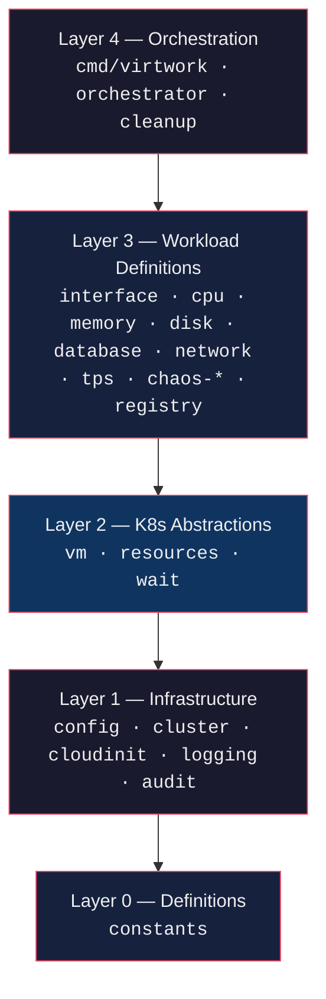
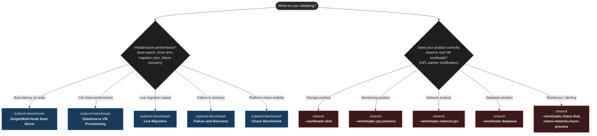
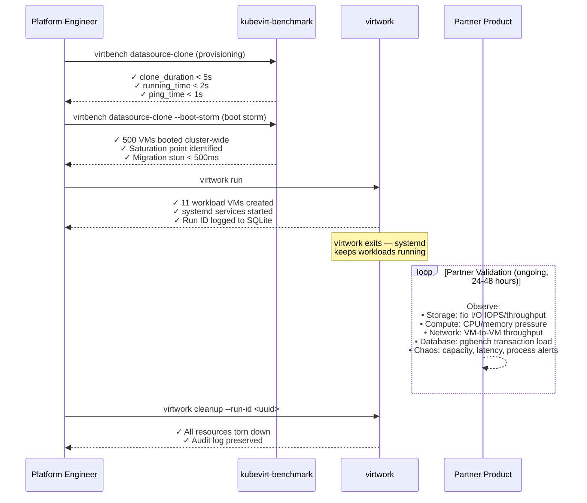

# virtwork vs kubevirt-benchmark

> A technical comparison of two tools for OpenShift Virtualization — one measures how fast and reliably the infrastructure provisions, migrates, and recovers VMs, and the other generates persistent workloads inside VMs for partner products to observe.

---

## 1. What Each Project Is — First Principles

The fastest way to understand the difference: **what question does each tool answer?**

| Tool | Core Question |
|---|---|
| **kubevirt-benchmark (virtbench)** | *"Can the infrastructure reliably provision, migrate, and recover KubeVirt VMs at scale, and how fast?"* |
| **virtwork** | *"Does my monitoring, storage, or network product correctly observe and handle real, persistent VM workloads?"* |

These are different problems. One measures the **infrastructure's capability** — how it performs under VM lifecycle operations. The other generates the **workload signals** that partner products must correctly observe after VMs are running.

---

## 2. What Each Project Is — In Detail

### kubevirt-benchmark (virtbench)

A **comprehensive performance benchmarking suite** for KubeVirt virtual machines, written in Python, maintained by Portworx (Pure Storage). It provides the `virtbench` CLI — a kubectl-like interface built on the Click framework — that orchestrates six distinct benchmark scenarios, decomposes end-to-end latency into sub-phase metrics, and generates JSON, CSV, and interactive HTML dashboards.

The tool was born from a fundamental insight: **pod readiness is not VM readiness.** A Kubernetes `Ready` condition is satisfied when a container process starts (milliseconds). A KubeVirt VMI is not operationally ready until the guest kernel boots, user-space services initialize, and the guest agent reports a heartbeat. Standard Kubernetes observability tools were designed around containerized workloads and fail to adequately measure VM-class performance.

**Design principles:**

- **Guest-centric readiness** — Deploys an in-cluster SSH test pod that issues continuous TCP probes to each VMI's assigned IP address. The timer closes only on successful TCP handshake, not on Kubernetes `Ready` status.
- **Latency decomposition** — Breaks end-to-end VM provisioning into three measured sub-phases:
  - `clone_duration` — CSI storage copy time (storage layer)
  - `running_time` — kubelet container/virt-launcher start (runtime layer)
  - `ping_time` — guest network probe completion (OS boot + initialization)
  - This isolation pinpoints whether performance bottlenecks originate in storage, container runtime, or guest OS.
- **Multi-disk CSI provisioning** — Tests configurations with boot disk, swap disk, and multiple high-performance data volumes attached to a single instance, reflecting production database VM complexity.
- **Vendor-neutral** — Works with any CSI-compliant storage (Portworx, Ceph, vSphere, AWS EBS) on any Kubernetes distribution with KubeVirt.

**Six benchmark scenarios:**

| Scenario | What It Measures | Key Metrics |
|---|---|---|
| **DataSource VM Provisioning** | Storage cloning efficiency and per-VM provisioning latency under sequential load | clone_duration, running_time, ping_time; P50/P95/P99 |
| **Single Node Boot Storm** | Node-level capacity under simultaneous VM power-on (all VMs on one node) | Boot latency at saturation, kernel/scheduler limits |
| **Multi-Node Boot Storm** | Cluster-wide startup performance, post-outage recovery simulation | Cluster-wide boot latency, storage provisioner throughput |
| **Live Migration** | VM migration stun time, sequential and parallel modes, SDN overlay overhead | Per-VMI migration duration, stun time (ms) |
| **Chaos Benchmark** | Platform stability under concurrent create, resize, clone, restart, snapshot operations | Success rates, latency under competing workloads |
| **Failure and Recovery** | HA validation via Fence Agents Remediation, node failure recovery | Time-to-recovery, RTO validation |

**Four internal modules:** DataSource Clone, Migration, Capacity, Failure Recovery.

**Output:** JSON and CSV for programmatic analysis; interactive HTML dashboard with charts showing creation duration trends, boot storm saturation curves, live migration performance, and percentile distributions.

**What it does NOT do:** create VMs that run persistent application workloads for an external product to observe. Its future roadmap includes planned in-VM fio tooling for I/O benchmarking from inside the guest OS — when released, that feature would overlap with virtwork's `disk` workload, though the intent would remain distinct.

---

### virtwork

A **one-shot VM workload deployment CLI** written in Go. It creates KubeVirt VMs on OpenShift with CNV installed and launches **continuous, persistent workloads inside them via systemd**. Then it exits.

**Key architectural decision from the README:**
> virtwork is a one-shot deployment tool — it creates resources and exits. Workload lifecycle management is handled by systemd inside each VM.

#### virtwork layered architecture



Workloads deployed inside VMs:

| Workload | Tool | What It Generates | Partner Validation Use |
|---|---|---|---|
| `cpu` | `stress-ng --cpu 0 --cpu-load 100 --cpu-method all` | Continuous CPU pressure across all cores (configurable via `params`) | Monitoring agent scrapes CPU% correctly |
| `memory` | `stress-ng --vm 1 --vm-bytes 80% --vm-method all` | Sustained memory pressure (configurable via `params`) | Memory metrics, pressure alerts, OOM handling |
| `disk` | `fio` with mixed random + sequential profiles | Mixed I/O patterns on a dedicated data disk | Storage agent reports IOPS, throughput, latency |
| `database` | PostgreSQL + `pgbench -c 10 -j 2 -T 300` | Realistic OLTP database transactions (configurable via `params`) | DB-aware monitoring, query performance tracking |
| `network` | `iperf3 -P 4 -t 60 --bidir` (server + client VM pairs) | Bidirectional throughput between VMs (configurable via `params`) | CNI/network product correct routing, throughput reporting |
| `tps` | `netperf` + Python HTTP server (server + client VM pairs) | Multi-port HTTP throughput with configurable file size and duration | Network product handles mixed protocol load |
| `chaos-disk` | `fallocate`/`dd` fill-release loop | Sustained disk-pressure events on a data disk | Storage alerts on capacity, product resilience |
| `chaos-network` | `tc` + `netem` qdisc | Injected latency and packet loss on egress | Network product detects degradation |
| `chaos-process` | shell + `ps`/`kill` | Random process termination inside the VM | Monitoring alerts on process death, recovery |

All workloads run as **systemd services** — they survive VM reboots and auto-restart on failure. They produce realistic signals for monitoring systems to observe and validate. The three chaos workloads extend this by injecting failures that exercise a partner product's alerting, recovery, and resilience handling.

**Audit tracking:** every run writes a UUID (`virtwork/run-id`) as a label on all K8s resources and records execution parameters, VM details, and events to a local SQLite database. Cleanup is label-based and error-tolerant.

**Deployment modes:** local binary or as an in-cluster pod via Kustomize manifests (`deploy/`).

---

## 3. Side-by-Side Comparison

| Dimension | kubevirt-benchmark (virtbench) | virtwork |
|---|---|---|
| **Primary purpose** | Measure KubeVirt infrastructure performance at scale | Deploy persistent VM workloads for partner product validation |
| **VM role** | VM is the **test subject** — measured | VM is the **environment** — container for workloads |
| **What it measures** | Boot latency, CSI clone time, migration stun, recovery speed | Not a measurement tool — generates signals for *other* tools to measure |
| **Workload type** | Transient (VM lifecycle operations are the load) | Persistent (real CPU/memory/disk/network/DB workloads inside VMs) |
| **Storage focus** | Latency decomposition: clone_duration (CSI) + running_time (kubelet) + ping_time (guest) | Sustained I/O workloads (fio, pgbench) *inside* running VMs |
| **Storage testing** | Multi-disk CSI provisioning (boot + swap + data vDisks), DataSource cloning | Dedicated data disk with fio mixed I/O patterns |
| **Failure testing** | Yes — Fence Agents Remediation, node failure recovery, chaos operations | No — assumes VMs remain running indefinitely |
| **Who runs it** | Platform engineers validating KubeVirt production readiness | OPL partners validating storage, monitoring, network products |
| **Language** | Python (Click CLI framework) | Go (controller-runtime client) |
| **Platform scope** | Vendor-neutral: any K8s + KubeVirt + any CSI | OpenShift-specific with CNV |
| **K8s client** | kubectl subprocess wrapper | controller-runtime |
| **Output** | JSON, CSV, interactive HTML dashboards | SQLite audit database + labels on K8s resources |
| **Readiness model** | In-cluster SSH probe pod → TCP handshake (guest-centric) | VMI readiness polling + optional SSH for debugging |
| **Config model** | CLI flags via Click, VM templates via YAML, `KUBECONFIG` env var | CLI flags → env vars → YAML config → defaults (Viper) |
| **Deployment** | External to cluster (binary or container) | Binary or in-cluster Kustomize pod |
| **Scale intent** | 100s–1000s of VMs for stress testing | 1–10s of VMs per workload for signal generation |
| **VM lifecycle** | Creates, migrates, restarts, snapshots, deletes VMs during benchmarks | Creates VMs, exits; systemd manages workloads permanently |
| **Maturity** | Active, Portworx-maintained, Apache 2.0 | Active development, Red Hat/opdev, Apache 2.0 |
| **Dependency on each other** | None | None — completely independent |

---

## 4. The Fundamental Difference — Infrastructure Performance vs. Workload Signals

The cleanest way to state the core distinction:

> **kubevirt-benchmark measures the infrastructure's ability to handle VMs.** Every metric — boot latency, CSI clone duration, migration stun time, recovery RTO — is about the platform and storage layer. What runs inside the VM is irrelevant; only an SSH probe verifies the guest booted.
>
> **virtwork generates what happens inside VMs.** The infrastructure is assumed working. What runs inside — `fio`, `iperf3`, `pgbench`, `stress-ng` — is the entire point, because a partner's storage, monitoring, or network product must observe and handle those signals over time.

Using **The Analogy Method**:

- **kubevirt-benchmark** is like a **dynamometer (engine testing machine)** — it runs an engine through controlled load cycles and measures horsepower, torque, and heat dissipation. The engine's fuel economy, emissions, and passenger comfort are irrelevant to the dynamometer.
- **virtwork** is like a **road test for automotive instruments** — it drives a real car on real roads and validates that the speedometer, fuel gauge, and check-engine light correctly report what the engine is actually doing under sustained load.

**The storage-layer nuance:** kubevirt-benchmark surgically decomposes where VM provisioning time is spent — `clone_duration` (CSI copy) versus `running_time` (kubelet startup) versus `ping_time` (guest boot). This precision isolates storage backend performance from Kubernetes scheduler latency from guest OS initialization. virtwork, by contrast, tests how a **storage monitoring product handles sustained I/O patterns** (fio mixed read/write on a running VM) — the inverse problem. One measures the storage pipeline that delivers the disk; the other exercises the disk after delivery.

**The planned in-VM fio overlap:** kubevirt-benchmark's roadmap includes "in-VM fio tooling for I/O benchmarking from inside the guest OS." When implemented, both tools will run fio inside VMs — but the purpose will remain distinct. kubevirt-benchmark will use fio to measure **infrastructure performance under real I/O** (storage backend throughput, CSI driver behavior). virtwork uses fio to generate a **signal that a partner's storage monitoring product must correctly report** (observed IOPS, latency percentiles, alerting on degradation). Same tool, orthogonal intent.

---

## 5. Overlaps

Despite the fundamental difference, there is real overlap:

1. **Both target KubeVirt VMs** — both create and manage VirtualMachine CRDs on Kubernetes clusters with KubeVirt
2. **Both use the Kubernetes API** — both interact with VMs, PVCs, DataVolumes, and VMIs
3. **Both can run in-cluster** — kubevirt-benchmark as a container, virtwork as a Kustomize-deployed pod
4. **Both use labels for resource tracking** — both label VMs for identification and cleanup
5. **Both verify SSH access** — kubevirt-benchmark uses in-cluster SSH probes for readiness; virtwork configures SSH for operator debugging
6. **Both support cleanup** — kubevirt-benchmark has `--cleanup` and `--dry-run-cleanup` flags; virtwork has `virtwork cleanup` with `--run-id` targeting
7. **Both are composable** — they sequence naturally into a complete validation pipeline

**The critical distinction in scale:** kubevirt-benchmark creates hundreds to thousands of VMs simultaneously for boot storm and capacity testing. virtwork creates 1–10 VMs per workload — enough to generate realistic signals (e.g., server/client pairs for network), not for stress testing cluster capacity.

**The closest point of overlap:** kubevirt-benchmark's chaos benchmark runs concurrent create, resize, clone, restart, and snapshot operations to test platform stability. virtwork's chaos workloads (chaos-disk, chaos-network, chaos-process) inject failures *inside* running VMs to test a partner product's alerting and recovery. Both use the word "chaos" but target different layers — platform stability versus in-VM resilience signals.

---

## 6. Use Case Decision Guide



### When kubevirt-benchmark is the right tool

- You're a platform engineer validating KubeVirt production readiness before running customer workloads
- You need infrastructure ceiling data: how many VMs can a single node boot? How many can the cluster migrate in parallel?
- You need to validate storage backend performance under CSI clone operations (DataSource cloning, multi-disk provisioning)
- You need to measure post-failure recovery time (node down → fence → recovery)
- You're migrating from VMware and need vMotion-equivalent stun time metrics
- You need HTML dashboards and CI-integrated pass/fail gates for infrastructure regression detection
- You need vendor-neutral validation across multiple Kubernetes distributions and CSI providers

### When virtwork is the right tool

- You're a Red Hat technology partner validating a product on OpenShift Partner Labs (OPL)
- Your product needs **real, sustained workloads** to test against — not just VM creation events
- You need workloads to survive VM reboots and run indefinitely as systemd services
- You want minimal config and a fast path: `virtwork run` and you're done
- The goal is product certification, PoC, or demo — not infrastructure performance engineering
- You need audit traceability per-run via SQLite (`--run-id` targeting for cleanup)
- You need chaos workloads that inject failures *inside* VMs to test your product's alerting and recovery logic

---

## 7. Infrastructure Performance vs. Partner Product Validation — Two Complementary Domains

**What kubevirt-benchmark actually measures:**

| Category | Measurement | Use Case |
|---|---|---|
| **Storage layer** | CSI clone_duration, multi-disk provisioning pipeline (DataVolume → PVC → block device), DataSource cloning efficiency | Storage backend validation, CSI provisioner tuning |
| **Compute layer** | VM boot latency at single-node and cluster-wide scale, concurrent VM creation ceiling | Scheduler performance, kernel limits, capacity planning |
| **Network layer** | SDN overlay migration overhead (stun time during live migration), guest network initialization (ping_time) | Network product performance during workload mobility |
| **Resilience** | Time-to-recovery after node failure, Fence Agents Remediation speed | HA automation, RTO/RPO validation |
| **Chaos** | Platform stability under concurrent create/resize/clone/restart/snapshot operations | API server limits, etcd performance, scheduler contention |

**What virtwork generates (signals for partner products to observe):**

| Category | Signal Generated | Partner Product Observes |
|---|---|---|
| **Storage** | fio mixed I/O (random + sequential) on data disk at sustained IOPS | Monitoring agent scrapes disk IOPS/throughput; storage observer alerts on latency |
| **Compute** | stress-ng CPU load (100% across all cores), memory pressure (80% RAM) | Dashboards show CPU%, memory%, OOM pressure; product triggers scaling |
| **Network** | iperf3 bidirectional throughput between server/client VMs, netperf multi-port | CNI/network product measures throughput, detects chaos-network packet loss |
| **Database** | PostgreSQL + pgbench OLTP (realistic transaction load) | Monitoring tracks query latency, transaction count; DB observer validates performance |
| **Chaos** | Disk fill (chaos-disk), latency/loss injection (chaos-network), process kills (chaos-process) | Alerts on capacity, network degradation, process death; product initiates remediation |

The key insight: **kubevirt-benchmark measures infrastructure. virtwork generates signals. Partner products observe those signals.** These are three steps on a single validation pipeline, not competing approaches.

---

## 8. Composing Both Tools — Complete Virtualization Validation Pipeline

The two tools sequence naturally into a comprehensive validation workflow:



**The pipeline flow:**

1. **Infrastructure validation** (kubevirt-benchmark, 1–2 hours) — Prove the cluster can provision, migrate, and recover VMs at scale. Identify storage bottlenecks via latency decomposition. Generate HTML dashboards for stakeholder review.
2. **Workload deployment** (virtwork, seconds) — Deploy persistent workload signals into validated infrastructure. VMs run fio, stress-ng, iperf3, pgbench, and chaos injectors as systemd services.
3. **Partner validation** (24–48 hours) — Partner product team observes real signals in their dashboards, validates metric accuracy, confirms alerting behavior, and exercises resilience handling.
4. **Cleanup** (virtwork, minutes) — Remove all resources by run ID, preserve audit trail in SQLite.

This sequence ensures the infrastructure is proven capable before partner validation begins, and ensures partner products are tested against realistic, sustained signals — not transient boot operations.

---

## 9. Key Config Reference

### kubevirt-benchmark (virtbench) CLI

```bash
# DataSource VM Provisioning — sequential creation, latency decomposition
virtbench datasource-clone \
  --start 1 --end 10 \
  --vm-name rhel-9-vm \
  --namespace-prefix datasource-clone \
  --concurrency 50 \
  --save-results --results-folder results \
  --storage-driver portworx

# Boot Storm — concurrent VM startup across the cluster
virtbench datasource-clone \
  --boot-storm \
  --start 1 --end 50 \
  --concurrency 50 \
  --save-results

# Single Node Boot Storm — all VMs pinned to one node
virtbench datasource-clone \
  --boot-storm --single-node \
  --node-name worker-0 \
  --start 1 --end 20

# Live Migration — sequential with stun time measurement
virtbench migration \
  --start 1 --end 10 \
  --source-node worker-0 \
  --save-results

# Live Migration — parallel evacuation
virtbench migration \
  --parallel --evacuate \
  --source-node worker-0 \
  --concurrency 50 \
  --save-results

# Chaos Benchmark — concurrent operations
virtbench chaos \
  --storage-class portworx-repl3 \
  --concurrency 20 \
  --vms 5 \
  --data-volume-count 2

# Failure and Recovery — FAR operator mode
virtbench failure-recovery \
  --mode far-operator \
  --node worker-0 \
  --recovery-timeout 600 \
  --save-results
```

**Common flags:** `--cleanup` (delete resources after test), `--dry-run-cleanup` (preview what would be deleted), `--yes` (skip confirmation), `--ssh-pod` / `--ssh-pod-ns` (in-cluster probe pod), `--save-results` (JSON/CSV output), `--log-file`.

**Environment variables:** `VIRTBENCH_REPO` (repository root), `KUBECONFIG` (cluster access).

**VM template variables:** `{{VM_NAME}}`, `{{STORAGE_CLASS_NAME}}`, `{{DATASOURCE_NAME}}`, `{{DATASOURCE_NAMESPACE}}`, `{{STORAGE_SIZE}}`, `{{VM_MEMORY}}`, `{{VM_CPU_CORES}}`.

### virtwork YAML config

```yaml
namespace: virtwork-prod
container_disk_image: quay.io/containerdisks/fedora:42
data_disk_size: 20Gi
ssh_user: virtwork
ssh_authorized_keys:
  - ssh-ed25519 AAAA...

workloads:
  cpu:
    enabled: true
    vm_count: 2
    cpu_cores: 4
    memory: 4Gi
  memory:
    enabled: true
  disk:
    enabled: true
  database:
    enabled: true
    cpu_cores: 2
    memory: 4Gi
  network:
    enabled: true    # creates server + client VM pairs
  tps:
    enabled: true
    params:
      file-size: "50M"
  chaos-disk:
    enabled: true
  chaos-network:
    enabled: true
  chaos-process:
    enabled: true
```

---

## 10. Conclusion

kubevirt-benchmark and virtwork are complementary, not competing tools. They address adjacent but non-overlapping problems, and the boundary between them is clearly defined.

kubevirt-benchmark answers: *how fast and reliably can the KubeVirt infrastructure handle VM provisioning, migration, and failure recovery at scale?* Every measurement — boot latency, CSI clone duration, migration stun time, recovery RTO — is about the **platform's capability**. Its unique contribution is latency decomposition: isolating CSI storage copy time from kubelet startup from guest OS initialization, which pinpoints exactly where infrastructure bottlenecks originate.

virtwork answers: *does a partner's storage, monitoring, or network product correctly observe and handle what happens inside VMs?* The platform is assumed working. The entire point is generating sustained, realistic signals — disk I/O, network throughput, database transactions, CPU and memory pressure, chaos events — that a partner product must prove it can observe, measure, and respond to over time.

**The storage-layer nuance:** kubevirt-benchmark surgically decomposes CSI performance (`clone_duration`) from guest initialization (`running_time`) from networking (`ping_time`). This precision isolates storage backend bottlenecks before workloads begin. virtwork tests how a storage monitoring product handles the sustained I/O patterns that occur *after* provisioning is complete. Orthogonal problems, same domain — one validates the delivery pipeline, the other validates what the pipeline delivered.

**Future planned overlap:** kubevirt-benchmark's roadmap includes in-VM fio tooling. When implemented, both tools will offer in-VM I/O benchmarking, but the purpose remains distinct: kubevirt-benchmark will measure infrastructure performance under real I/O; virtwork generates I/O signals for partner product validation. Red Hat's own performance team made this boundary explicit in their kube-burner scale testing guide, noting that complete validation requires not just "how fast does infrastructure deploy VMs" but also "run a workload in the VMs" to stress underlying resources from inside. kubevirt-benchmark answers the first; virtwork answers the second.

Used together in an OPL validation pipeline:
1. kubevirt-benchmark proves the infrastructure is ready
2. virtwork deploys persistent signals into validated VMs
3. Partner products validate they observe and handle those signals correctly
4. Both tools ensure comprehensive validation — from infrastructure performance through partner product certification

Neither tool renders the other redundant.

---

## 11. References

- [kubevirt-benchmark GitHub](https://github.com/portworx/kubevirt-benchmark)
- [kubevirt-benchmark Documentation](https://portworx.github.io/kubevirt-benchmark/)
- [Benchmarking KubeVirt Performance with virtbench (CNCF Blog)](https://www.cncf.io/blog/2026/06/08/benchmarking-kubevirt-performance-with-virtbench/)
- [Is KubeVirt Ready? Benchmarking Metrics for VMware Admins (Portworx Blog)](https://portworx.com/blog/kubevirt-production-readiness-benchmark/)
- [virtwork GitHub](https://github.com/opdev/virtwork)
- [OpenShift Partner Lab Overview](https://connect.redhat.com/en/blog/the-openshift-partner-lab)
- [Use kube-burner to measure OpenShift VM and storage deployment at scale](https://developers.redhat.com/articles/2024/09/04/use-kube-burner-measure-red-hat-openshift-vm-and-storage-deployment-scale)
- [KubeVirt Official Documentation](https://kubevirt.io/)
